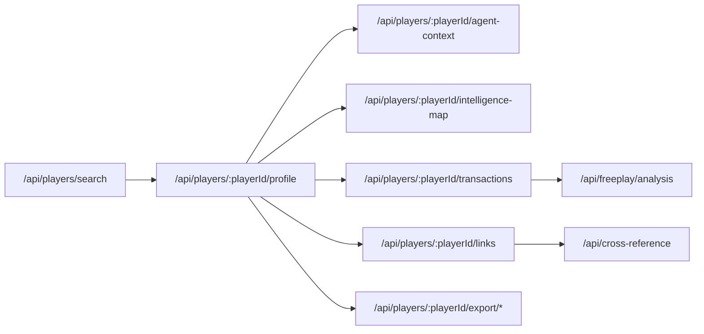
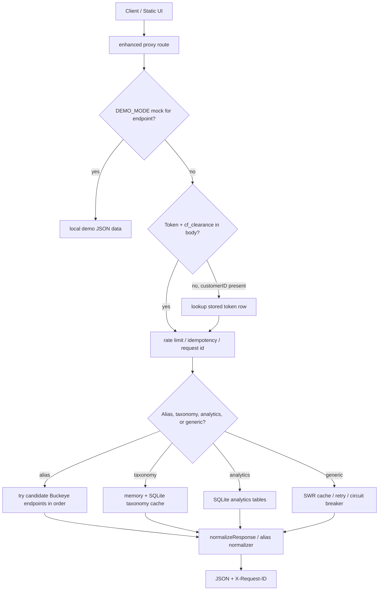
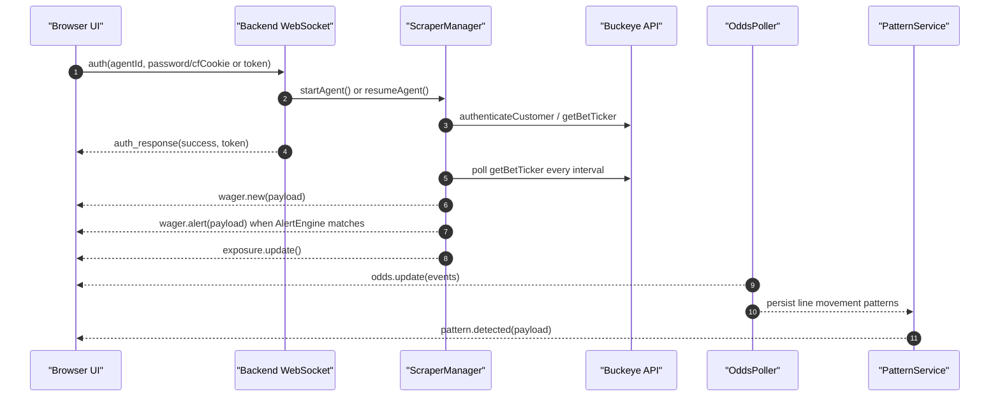

# Sports Terminal — API Endpoint Reference

> **Live server:** `http://localhost:3000`
> **Captured:** May 9, 2026 — All examples are real responses from the running server.

---

## Public API Boundary

The Sports Terminal backend on `http://localhost:3000` is the public API surface for the Trading Floor and any frontend application. Frontend code should call `3000` only.

The standalone enhanced proxy on `http://localhost:3001` is internal/debug tooling for direct Buckeye diagnostics, endpoint discovery, cache testing, and isolated ticker experiments. Its routes are documented here for operators and maintainers, but they should not be treated as the frontend contract.

When a frontend needs live Buckeye data, prefer a `3000` route that exposes an explicit live mode. Example:

| Need | Public route on `3000` | Source |
|------|-------------------------|--------|
| Fast backfilled agent downline | `GET /api/agents/downline` | Local SQLite aggregate |
| Live Buckeye agent downline | `GET /api/agents/downline?live=true` | Active Buckeye session via `Manager/getListAgenstByAgent` |

### Authentication Matrix

| Layer | Used By | Credential | Where It Appears |
|-------|---------|------------|------------------|
| Backend API (`3000`) | Main UI and integrations | Terminal JWT or dev-mode bypass; admin token for sensitive mutations when configured | `Authorization: Bearer <jwt>` or `X-Admin-Token` |
| Backend Buckeye session | Backend polling and live read-through routes | Vaulted Buckeye token, password, and Cloudflare cookie | Stored by `BunSecretVault`; not exposed in frontend route contracts |
| Standalone enhanced proxy (`3001`) | Internal diagnostics and direct proxy smoke tests | Optional proxy API key plus Buckeye token and `cf_clearance` | `X-API-Key`, JSON body, or stored proxy token row |
| Upstream Buckeye | Backend/proxy internals only | Buckeye bearer token, `cf_clearance`, optional `__cf_bm` | Sent only from backend/proxy to `fantasy402.com` |

### Common Pitfalls

| Pitfall | Fix |
|---------|-----|
| Calling enhanced proxy aliases on `3000` | Supported for backend/internal use. The backend forwards `/api/proxy/{alias}` and `/api/proxy/taxonomy/{level}` to the internal proxy with `X-API-Key` and vaulted Buckeye credentials. Frontend features should still prefer explicit product routes such as `GET /api/agents/downline?live=true` when available. |
| Building frontend code against `localhost:3001` | Add or use a `3000` backend route instead. |
| Missing `X-API-Key` on a protected proxy diagnostic route | Set the configured proxy API key, or disable it only in local trusted testing. |
| Expired `cf_clearance` | Refresh the Cloudflare cookie in browser DevTools and reconnect the Buckeye session. |

## Canonical v3 Contract

This is the production contract going forward:

```text
Frontend SPA -> Backend API (3000) -> Internal proxy (3001) -> Buckeye upstream
```

| Port | Role | Caller | Notes |
|------|------|--------|-------|
| `3000` | Public Sports Terminal API | Frontend and integrations | The only API surface the React SPA should call. |
| `3001` | Internal enhanced proxy | Backend and operators debugging | Direct Buckeye diagnostics, cache tests, proxy WebSocket experiments. |
| `443` | Buckeye upstream | Backend/proxy only | Never called directly by frontend code. |

### Public Backend API (`3000`)

These are the frontend-facing route families. Detailed request and response examples remain in the sections below.

| Area | Routes |
|------|--------|
| Auth/session | `POST /api/connect`, `GET /api/buckeye/vault-status`, `DELETE /api/buckeye/vault-status` |
| Health/observability | `GET /health`, `GET /api/health/system-status`, `GET /api/stats`, `GET /api/analytics/raw-logs`, `GET /api/betting/velocity`, `GET /api/betting/live-vs-pre`, `GET /api/logs/access`, `GET /api/master/history` |
| Wagers | `GET /api/wagers`, `GET /api/wagers/alerts`, `GET /api/wagers/live` |
| Agents/downline | `GET /api/agents`, `GET /api/agents/downline`, `GET /api/agents/downline?live=true`, `GET /api/agents/hierarchy`, `GET /api/agents/hierarchy/tree`, `GET /api/agents/access-logs`, `GET /api/agents/:agentId/performance`, `GET /api/agents/:agentId/exposure`, `GET /api/agents/:agentId/players`, `POST /api/agents/backfill/hierarchy` |
| Players | `GET /api/players/search`, `GET /api/players/:playerId/details`, `GET /api/players/:playerId/wagers`, `GET /api/players/:playerId/pnl`, `GET /api/players/:playerId/profile`, `GET /api/players/:playerId/transactions`, `GET /api/freeplay/analysis`, `GET /api/cross-reference` |
| Risk/exposure | `GET /api/risk/alerts`, `GET /api/exposure/sports`, `GET /api/exposure/agents` |
| Odds/patterns | `GET /api/odds/live`, `GET /api/odds/events`, `GET /api/odds/events/:eventId`, `GET /api/odds/snapshots`, `GET /api/odds/movements`, `GET /api/books`, `GET /api/books/status`, `GET /api/patterns/catalog`, `GET /api/patterns/history`, `GET /api/patterns/summary`, `GET /api/patterns/agents` |
| Performance/audit | `GET /api/performance/summary`, `GET /api/performance/details`, `GET /api/analytics/weekly-figures`, `GET /api/analytics/master-snapshots`, `GET /api/analytics/performance-trends`, `GET /api/analytics/wager-velocity`, `GET /api/health/data-pipeline` |
| Webhooks | `GET /api/webhooks`, `POST /api/webhooks`, `GET /api/webhooks/:webhookId`, `PUT /api/webhooks/:webhookId`, `DELETE /api/webhooks/:webhookId`, `GET /api/webhooks/:webhookId/deliveries` |
| CSV exports | `GET /api/export/wagers`, `GET /api/export/access-logs`, `GET /api/export/performance` |
| Internal proxy bridge | `POST /api/proxy/:alias`, `POST /api/proxy/taxonomy/:level`, `POST /api/proxy/Manager/:operation`, `POST /api/proxy/System/:operation`, `POST /api/proxy/Log/:operation` |

### Internal Proxy API (`3001`)

These routes are not for frontend use. They are documented for backend developers and operators.

| Area | Routes |
|------|--------|
| Health/config | `GET /`, `GET /features`, `GET /metrics`, `GET /ready`, `GET /health`, `POST /config` |
| Auth/tokens | `POST /api/proxy/auth`, `POST /api/proxy/renewToken`, `GET /api/proxy/tokens?customerID=` |
| Buckeye aliases | `POST /api/proxy/sportsLeagues`, `POST /api/proxy/leagueLines`, `POST /api/proxy/agentDownline`, `POST /api/proxy/agentBilling`, `POST /api/proxy/playerInfo`, `POST /api/proxy/dynamicLive`, `POST /api/proxy/gameVolume`, `POST /api/proxy/pending`, `POST /api/proxy/pendingReportConfig`, `POST /api/proxy/updatePendingReportConfig` |
| Analytics | `POST /api/proxy/analytics/syndicates`, `GET /api/proxy/analytics/syndicates/stats`, `POST /api/proxy/analytics/sharp-money`, `POST /api/proxy/analytics/ev`, `POST /api/proxy/analytics/predictive-sharpness`, `POST /api/proxy/analytics/backtest` |
| Risk/integrity | `GET/POST /api/proxy/risk/config`, `GET /api/proxy/risk/alerts`, `GET /api/proxy/risk/syndicates`, `GET/POST /api/proxy/line-rules`, `GET /api/proxy/line-adjustments/log`, `GET/POST /api/proxy/integrity/cases`, `PATCH /api/proxy/integrity/cases/:id` |
| Logs | `GET /api/proxy/logs`, `GET /api/proxy/health`, `GET /api/proxy/endpoints` |

### Quick Port Reference

| Task | Port | Route | Intended Caller |
|------|------|-------|-----------------|
| Login user | `3000` | `POST /api/connect` | Frontend |
| Get wager list | `3000` | `GET /api/wagers` | Frontend |
| Get cached agent downline | `3000` | `GET /api/agents/downline` | Frontend |
| Get live Buckeye downline | `3000` | `GET /api/agents/downline?live=true` | Frontend |
| Live ticker UI | `3000` | `ws://localhost:3000` | Frontend |
| Debug Buckeye auth | `3001` | `POST /api/proxy/auth` | Operator/backend |
| Debug pending wagers | `3001` | `POST /api/proxy/pending` | Operator/backend |
| Debug live events | `3001` | `POST /api/proxy/dynamicLive` | Operator/backend |
| Debug syndicates | `3001` | `POST /api/proxy/analytics/syndicates` | Operator/backend |

### Live Discovery Notes

The backend currently exposes health through `GET /health` and system state through `GET /api/health/system-status`; it does not expose `GET /features` on `3000`. The enhanced proxy exposes `GET /features`, `GET /metrics`, `GET /openapi.json`, and `GET /api/proxy/endpoints` on `3001`.

Backend-to-proxy internal calls are implemented in `backend/src/services/ProxyClient.ts`. The bridge reads active/vaulted Buckeye token and Cloudflare cookie material from `BuckeyeScraperManager`, forwards to `PROXY_INTERNAL_URL` (default `http://localhost:3001`), and adds `X-API-Key` from `PROXY_API_KEY`.

Generate a backend OpenAPI snapshot from route registrations with:

```powershell
bun run generate:openapi
```

## Table of Contents

1. [Health & Status](#1-health--status)
2. [Wagers](#2-wagers)
3. [Agents](#3-agents)
4. [Players](#4-players)
5. [Risk & Exposure](#5-risk--exposure)
6. [Odds & Patterns](#6-odds--patterns)
7. [Buckeye Routes & Internal Proxy](#7-buckeye-routes--internal-proxy)
8. [Performance Cache](#8-performance-cache)
9. [Webhooks](#9-webhooks)
10. [Audit & Analytics](#10-audit--analytics)
11. [CSV Exports](#11-csv-exports)
12. [WebSocket Events](#websocket-events)
13. [Error Handling & Recovery](#error-handling--recovery)

---

## Route Coverage Audit

This document should be checked against the router, Buckeye route metadata, and enhanced proxy catalog when routes move. Last reconciliation source files:

| Surface | Source File | Route Count | Coverage Note |
|---------|-------------|-------------|---------------|
| Main backend router | `backend/src/api/router.ts` | 104 API-visible route patterns, 106 total registrations including CORS/static catch-all | Most routes have detailed sections below; compatibility/wildcard routes are summarized here to avoid repeating every Buckeye operation twice. |
| Buckeye backend route handler | `backend/src/api/routes/buckeye.ts` | 20+ direct Buckeye helper routes plus limited `/api/proxy/*` compatibility routes on `3000` | Includes player probe routes, manager bootstrap, vault status, and compatibility manager/system/log operations. Alias routes such as `/api/proxy/agentDownline` belong to the standalone proxy, not the public backend. |
| Standalone enhanced proxy | `proxy-enhanced.ts` + `endpoint-index.ts` | 68 catalog endpoints: 19 proxy/local + 49 Buckeye upstream | Internal/debug surface on `3001`. `TEST_SUMMARY.total` is 50 tested probes, not the catalog endpoint count. |

Quick local audit command:

```powershell
@'
const fs = require('fs');
const router = fs.readFileSync('backend/src/api/router.ts', 'utf8');
const docs = fs.readFileSync('docs/API_ENDPOINTS.md', 'utf8');
const routes = [...router.matchAll(/router\.(get|post|put|patch|delete|options)\('([^']+)'/g)]
  .map((m) => `${m[1].toUpperCase()} ${m[2]}`);
console.log(routes.filter((route) => !docs.includes(route.split(' ')[1])).join('\n'));
'@ | node
```

### Source-Generated Endpoint and Param Inventory

Generated from `endpoint-index.ts`, `proxy-enhanced.ts`, and `backend/src/api/router.ts`.

| Surface | Source | Endpoint Count | Param Count | Notes |
|---------|--------|----------------|-------------|-------|
| Backend router | `backend/src/api/router.ts` | 104 API-visible, 106 total registrations | 33 path-param occurrences | Query/body params are route-handler specific and not fully centralized in the router. |
| Proxy catalog | `endpoint-index.ts` `PROXY` | 19 | 46 explicit params | Local proxy, analytics, risk, line-rule, and report-config routes. |
| Buckeye catalog | `endpoint-index.ts` `BUCKEYE` | 49 | 209 explicit params | Source of truth for upstream Buckeye form params. |
| Catalog total | `endpoint-index.ts` | 68 | 255 explicit params | This is the main documented endpoint inventory. |
| Enhanced aliases | `proxy-enhanced.ts` `PROXY_ALIAS_PARAMS` | 9 aliases | 73 alias params | Convenience wrappers that add `token`, `cf_clearance`, and operator-friendly request bodies. |

#### Common Buckeye 4-Param Shape

The following 28 Buckeye catalog entries use exactly:

```json
{
  "operation": "endpoint-specific-operation",
  "agentID": "BILLY666",
  "agentOwner": "BILLY666",
  "agentSite": "1"
}
```

`System/renewToken`, `Manager/getAccountInfoOwner`, `Manager/getNewEmailsCount`, `Manager/getMail`, `Manager/getAuthorizations`, `Manager/getCryptoInfo`, `Manager/getCryptoAvailable`, `Manager/getDynamicLive`, `Manager/getSportsTypesLive`, `Manager/getProps`, `Manager/getExtendedProps`, `Manager/getTeaserProfile`, `Manager/getListAgenstByAgent`, `Manager/getAgentBilling`, `Manager/getAgentManagement`, `Manager/getListVip`, `Manager/getSportsCustomerAdmin`, `Manager/getSportsVigSetup`, `Manager/getSportsMaxWager`, `Manager/getColorsSelections`, `Manager/getStores`, `Manager/getCircleLimits`, `Manager/getSportsType`, `Manager/getBetTicker`, `Manager/getBetTickerConfig`, `Manager/getOpenBets`, `Manager/getMessage`, `Manager/getConfigWebReports`.

#### Buckeye Catalog Exceptions

These are the Buckeye endpoints that do not use the exact common 4-param body.

| Endpoint | Count | Params |
|----------|------:|--------|
| `System/authenticateCustomer` | 3 | `customerID`, `password`, `cf_clearance` |
| `Log/write` | 5 | `operation`, `agentID`, `agentOwner`, `agentSite`, `msg` |
| `Manager/getInfoPlayer` | 5 | `operation`, `playerLogin`, `agentID`, `agentOwner`, `agentSite` |
| `League/Get_SportsLeagues` | 2 | `operation`, `RRO` |
| `Lines/Get_LeagueLines2` | 3 | `league`, `sport`, `RRO` |
| `Manager/getGames` | 3 | `operation`, `sport`, `RRO` |
| `Manager/getGameVolume` | 3 | `operation`, `gameId`, `RRO` |
| `Lines/getBuyPointsGroup` | 2 | `operation`, `RRO` |
| `Limit/getAmountLimitGroup` | 2 | `operation`, `RRO` |
| `Manager/getPeriodsBySport` | 3 | `operation`, `sport`, `RRO` |
| `Provider/getLinesPlusData` | 1 | `RRO` |
| `Report/getScoresLiveDynamic` | 1 | `RRO` |
| `Provider/getPropBuilderGameScheduleURL` | 2 | `operation`, `RRO` |
| `Manager/getAgentPerformance` | 9 | `operation`, `agentID`, `agentOwner`, `agentSite`, `startDate`, `endDate`, `type`, `freePlay`, `RRO` |
| `Manager/getReportPlayerAnalysis` | 5 | `operation`, `playerLogin`, `agentID`, `agentOwner`, `agentSite` |
| `Manager/getEnterTransactions` | 5 | `operation`, `playerLogin`, `agentID`, `agentOwner`, `agentSite` |
| `Manager/getPending` | 10 | `operation`, `date`, `wagerType`, `amount`, `sort`, `typeSort`, `week`, `customerID`, `agentOwner`, `agentSite` |
| `Manager/getConfigWebReportsPending` | 5 | `operation`, `agentID`, `agentOwner`, `agentSite`, `RRO` |
| `Manager/updateReportConfigPending` | 14 | `operation`, `agentID`, `agent`, `customerID`, `password`, `name`, `timeAccepted`, `timeScheduled`, `type`, `print`, `delete`, `custTotal`, `agentOwner`, `agentSite` |
| `Manager/getWebLog` | 8 | `operation`, `agentID`, `customerID`, `start`, `end`, `type`, `actions`, `RRO` |
| `Manager/getWeeklyFigureByAgentLite` | 6 | `operation`, `agentID`, `agentOwner`, `agentSite`, `startDate`, `endDate` |

#### Pending Report Select Mappings

`Manager/getPending` uses Buckeye's native select values:

```json
{
  "wagerType": {
    "": "All Types",
    "S": "Straight",
    "P": "Parlay",
    "I": "If Bets",
    "T": "Teaser",
    "G": "Racebook",
    "A": "Manual Plays",
    "C": "Contest",
    "N": "Live/Props"
  },
  "week": {
    "730": "All",
    "0": "Today",
    "3": "3 Days",
    "7": "7 days",
    "14": "14 days"
  }
}
```

#### Proxy Catalog Params

These rows describe the standalone enhanced proxy catalog on `3001`, not the frontend contract. The main backend on `3000` only exposes a limited proxy-compatible namespace (`/api/proxy/Manager/:operation`, `/api/proxy/System/:operation`, `/api/proxy/Log/:operation`, and status helpers). Prefer first-class `3000` routes for frontend work.

| Endpoint | Count | Params |
|----------|------:|--------|
| `/` | 0 | none |
| `/api/proxy/status?customerID=` | 0 | none in catalog metadata |
| `/api/proxy/endpoints` | 0 | none |
| `/api/proxy/logs` | 0 | none |
| `/api/proxy/tokens?customerID=` | 0 | none in catalog metadata |
| `/api/proxy/renewToken` | 1 | `customerID` |
| `/api/proxy/analytics/syndicates` | 4 | `agentID`, `lookbackHours`, `minBettors`, `minStake` |
| `/api/proxy/analytics/sharp-money` | 3 | `agentID`, `gameId`, `minutesBefore` |
| `/api/proxy/analytics/ev-simulation` | 4 | `agentID`, `bettorID`, `modelType`, `lookbackDays` |
| `/api/proxy/analytics/predictive-sharpness` | 3 | `agentID`, `bettorID`, `lookbackDays` |
| `/api/proxy/analytics/backtest` | 3 | `agentID`, `days`, `rules` |
| `/api/proxy/risk/alerts` | 3 | `agentID`, `thresholds`, `webhookUrl` |
| `/api/proxy/risk/config` | 1 | `agentID` |
| `/api/proxy/risk/syndicates` | 2 | `agentID`, `since` |
| `/api/proxy/line-rules` | 1 | `agentID` |
| `/api/proxy/line-adjustments/log` | 3 | `gameId`, `since`, `limit` |
| `/api/proxy/pendingReportConfig` | 3 | `agentID`, `agentOwner`, `agentSite` |
| `/api/proxy/updatePendingReportConfig` | 13 | `agentID`, `agent`, `customerID`, `password`, `name`, `timeAccepted`, `timeScheduled`, `type`, `print`, `delete`, `custTotal`, `agentOwner`, `agentSite` |
| `/api/proxy/agent/heatmap` | 2 | `agentID`, `days` |

#### Enhanced Alias Params

Aliases are curl-friendly wrappers implemented by `proxy-enhanced.ts` on `3001`. For frontend use, add a backend route on `3000` that calls Buckeye internally or reads from the local database.

| Alias | Required | Optional | Total |
|-------|----------|----------|------:|
| `sportsLeagues` | `token`, `cf_clearance` | `agentID`, `customerID` | 4 |
| `leagueLines` | `token`, `cf_clearance`, `league`, `sport` | `agentID`, `customerID`, `period`, `live`, `gameId` | 9 |
| `agentDownline` | `token`, `cf_clearance`, `agentID` | `customerID`, `agentType`, `agentOwner`, `agentSite` | 7 |
| `agentBilling` | `token`, `cf_clearance`, `agentID` | `customerID`, `agentSite`, `week`, `startDate`, `endDate` | 8 |
| `playerInfo` | `token`, `cf_clearance`, `playerID` | `agentID`, `customerID`, `bettorID`, `startDate`, `endDate` | 8 |
| `dynamicLive` | `token`, `cf_clearance` | `agentID`, `customerID`, `sport`, `league`, `live` | 7 |
| `gameVolume` | `token`, `cf_clearance`, `gameId` | `agentID`, `customerID`, `sport`, `league`, `GameID` | 8 |
| `pendingReportConfig` | `token`, `cf_clearance`, `agentID` | `agentOwner`, `agentSite`, `__cf_bm` | 6 |
| `updatePendingReportConfig` | `token`, `cf_clearance`, `agentID` | `agent`, `customerID`, `password`, `name`, `timeAccepted`, `timeScheduled`, `type`, `print`, `delete`, `custTotal`, `agentOwner`, `agentSite`, `__cf_bm` | 16 |

Routes that are registered and should remain visible in this document, even when their full response examples live in deeper docs:

| Area | Method | Route | Source Handler | Key Params / Body | Response Summary | Notes |
|------|--------|-------|----------------|-------------------|------------------|-------|
| Agents | GET | `/api/agents/hierarchy/tree` | `registerCachedAgentHierarchyTreeRoutes` | none | Cached recursive hierarchy tree plus flat agents | Distinct from `/api/agents/hierarchy`, optimized for sidebar/tree canvas. |
| Agents | POST | `/api/agents/refresh` | `registerAgentRefreshRoutes` | `{ "agentId": "BILLY666" }` | Refresh acknowledgement | Sensitive mutation; guarded by `ADMIN_API_TOKEN` when configured. |
| Agents | GET | `/api/agents/:agentId/players` | `registerAgentPlayersRoutes` | path `agentId` | Players under one agent | Local archive/downline projection. |
| Players | GET | `/api/players/search` | `registerPlayerSearchRoutes` | `q`, `agent`, `limit`, `offset` | Search results and agent filters | Canonical local search route. |
| Players | GET | `/api/players/:playerId/profile` | `registerPlayerProfileRoutes` | path `playerId` | Player 360 profile | Canonical route for Player Detail profile. |
| Players | GET | `/api/players/:playerId/agent-context` | `registerPlayerAgentContextRoutes` | path `playerId` | Assigned agent and lineage context | Used by investigation panels. |
| Players | GET | `/api/players/:playerId/intelligence-map` | `registerPlayerIntelligenceMapRoutes` | path `playerId` | Source coverage, freshness, gaps | Explains which Player 360 sources are live, stale, probe, missing, or error. |
| Players | GET | `/api/players/:playerId/deposits` | `registerPlayerDepositsRoutes` | path `playerId` | Deposit candidates | Local-only normalized deposit/transaction view. |
| Players | GET | `/api/players/:playerId/transactions` | `registerPlayerTransactionsRoutes` | `category`, `from`, `to`, `limit` | Transaction ledger | Supports `category=freeplay`. |
| Players | GET | `/api/players/:playerId/account-snapshots` | `registerPlayerAccountSnapshotsRoutes` | path `playerId` | Account/profile snapshots | Snapshot history from confirmed Buckeye probes. |
| Players | GET | `/api/players/:playerId/links` | `registerPlayerLinksRoutes` | path `playerId` | Linked player/account evidence | Used by cross-reference and multi-account review. |
| Players | POST | `/api/players/:playerId/links/check` | `registerPlayerLinkCheckRoutes` | `{ "otherPlayerId": "..." }` | Link-check result | Sensitive mutation when persisted. |
| Players | GET/POST | `/api/players/:playerId/flags` | `registerPlayerFlagsRoutes`, `registerPlayerFlagCreateRoutes` | flag create body | Player flags | POST is a mutation; guarded when admin token is configured. |
| Players | POST | `/api/players/:playerId/flags/:flagId/resolve` | `registerPlayerFlagResolveRoutes` | path `flagId` | Resolve acknowledgement | Closes one player flag. |
| Players | GET/POST | `/api/players/:playerId/notes` | `registerPlayerNotesRoutes`, `registerPlayerNoteCreateRoutes` | note create body | Operator notes | POST is a mutation. |
| Players | GET | `/api/players/:playerId/export/wagers` | `registerPlayerExportRoutes` | path `playerId` | CSV wager export | Player-scoped CSV. |
| Players | GET | `/api/players/:playerId/export/access-logs` | `registerPlayerExportRoutes` | path `playerId` | CSV access-log export | Player-scoped CSV. |
| Free Play | GET | `/api/freeplay/analysis` | `registerFreePlayAnalysisRoutes` | `playerId`, `agentId`, `from`, `to`, `groupBy` | Free-play totals and confidence | Canonical local route. |
| Cross Reference | GET | `/api/cross-reference` | `registerCrossReferenceRoutes` | `playerId`, `agentId` | Local investigation graph | Canonical local route. |
| Buckeye probes | GET/POST | `/api/buckeye/player-performance` | `registerBuckeyeRoutes` | `agentId`, `playerId`, date params | Player performance probe | Calls active Buckeye agent; stores/normalizes only proven fields. |
| Buckeye probes | GET/POST | `/api/buckeye/player-info` | `registerBuckeyeRoutes` | `agentId`, `playerId` | Player info probe | Profile/account source candidate. |
| Buckeye probes | GET/POST | `/api/buckeye/player-transactions` | `registerBuckeyeRoutes` | `agentId`, `playerId`, date params | Player ledger probe | Used for Player 360 transaction refresh. |
| Backend proxy compatibility | GET | `/api/proxy/status` | `handleProxyCompatibleRoute` | optional `customerID` | Proxy-compatible backend status | Public only as a compatibility/status helper; separate from standalone proxy `/api/proxy/status`. |
| Backend proxy compatibility | POST | `/api/proxy/renewToken` | `handleProxyCompatibleRoute` | `customerID` or stored token context | Renewed token payload | Backend-compatible renew route. |
| Backend proxy compatibility | POST | `/api/proxy/Manager/:operation` | `handleProxyCompatibleRoute` | operation-specific form body | Buckeye manager operation result | Covers operations listed in `/api/proxy/endpoints`. |
| Backend proxy compatibility | POST | `/api/proxy/System/:operation` | `handleProxyCompatibleRoute` | operation-specific form body | Buckeye system operation result | Primarily `renewToken`. |
| Backend proxy compatibility | POST | `/api/proxy/Log/:operation` | `handleProxyCompatibleRoute` | log payload | Buckeye log operation result | Primarily activity/log writes. |

Do not confuse these backend compatibility routes with the enhanced proxy aliases. For example, `GET /api/agents/downline?live=true` is the public `3000` route for live downline data; `/api/proxy/agentDownline` is a `3001` diagnostic alias.

Canonical Player 360 route flow:



## 1. Health & Status

### `GET /health`

Server health check with uptime and active agent info.

**Response 200:**
```json
{
  "status": "ok",
  "uptime": 568.86,
  "scrapers": {
    "activeAgents": 1,
    "agents": [
      {
        "agentId": "BILLY666",
        "lastPoll": 1778340008911,
        "errorCount": 0,
        "authenticated": true
      }
    ],
    "actionQueue": {
      "totalQueued": 0,
      "queues": {}
    },
    "counters": {
      "wagers_total": 529,
      "alerts_triggered_total": 144,
      "errors_total": 0
    }
  }
}
```

### `GET /api/health/system-status`

Consolidated System Status issue feed for operator bug/risk tracking. Rolls up scraper errors, action queue backlog, recent raw API failures, grouped Player 360 source errors, offline odds books, enhanced proxy readiness, and critical/high patterns. Repeated Player 360 failures caused by an expired Buckeye session are grouped into one agent-level issue so operators can distinguish session/upstream failures from parser or database bugs.

Risk is intentionally split from operations:

| Field | Meaning |
|-------|---------|
| `status` | Overall rollup: critical risk or critical ops make the system critical; degraded proxy readiness makes the rollup warning. |
| `operationalStatus` | Backend, ingestion, queue, database, odds-book, Player 360, data-flow, and proxy readiness state. Values: `ok`, `degraded`, `warning`, `critical`. |
| `patternRiskStatus` | Recent pattern risk state from `detected_patterns` in the last hour. Values: `ok`, `warning`, `critical`. |
| `criticalPatternRiskByType` | Critical pattern counts by `detected_patterns.type` for the last hour. |
| `warningPatternRiskByType` | Warning pattern counts by `detected_patterns.type` for the last hour. |
| `patternRiskExpiresAt` | The natural auto-reset time, computed as latest recent pattern risk detection plus one hour. `null` when pattern risk is clear. |
| `enhancedProxyHealth` | Internal enhanced proxy readiness from `PROXY_INTERNAL_URL` `/ready`: `ok`, `degraded`, or `critical`. |
| `riskStatus`, `riskBreakdown`, `riskWarningBreakdown`, `riskStatusExpiresAt`, `proxyHealth` | Compatibility aliases for the initial health integration. New code should use the explicit `patternRisk*`, `*PatternRiskByType`, and `enhancedProxyHealth` names. |
| `details.staleOddsBooks` | Book health rows whose `last_seen` is older than 12 hours. |
| `details.enhancedProxy` | Structured enhanced proxy readiness object with `status`, `ready`, `statusCode`, `checkedAt`, and raw `/ready` `details`. |
| `details.proxyDetails` | Compatibility alias for the raw enhanced proxy `/ready` body. |

```json
{
  "status": "warning",
  "operationalStatus": "degraded",
  "patternRiskStatus": "critical",
  "criticalPatternRiskByType": {
    "steam_chase": 2
  },
  "warningPatternRiskByType": {
    "line_velocity": 3
  },
  "patternRiskExpiresAt": "2026-05-10T01:30:00.000Z",
  "enhancedProxyHealth": "degraded",
  "riskStatus": "critical",
  "riskBreakdown": {
    "steam_chase": 2
  },
  "riskWarningBreakdown": {
    "line_velocity": 3
  },
  "riskStatusExpiresAt": "2026-05-10T01:30:00.000Z",
  "proxyHealth": "degraded",
  "generatedAt": "2026-05-09T23:35:00.000Z",
  "summary": {
    "activeAgents": 1,
    "rawApiFailures24h": 0,
    "playerSourceErrors": 0,
    "issues": 0,
    "critical": 0,
    "warning": 0,
    "patternRiskCritical1h": 2,
    "patternRiskWarning1h": 3,
    "riskCritical1h": 2,
    "riskWarning1h": 3,
    "staleOddsBooks": 1
  },
  "dataFlows": {
    "liveWagers": {"status": "live", "rowCount": 25654, "lastSeen": "2026-05-10T00:33:23.905Z"},
    "wagerArchive": {"status": "live", "rowCount": 25654, "distinctWagers": 25654, "reconciled": true},
    "playerTransactions": {"status": "live", "rowCount": 1979630},
    "agentHierarchy": {"status": "live", "rowCount": 2288, "roots": 3, "maxLevel": 17},
    "playerAgentMap": {"status": "live", "rowCount": 56028, "orphanCount": 0},
    "patterns": {"status": "live", "rowCount": 929, "last24h": 929},
    "exposureInputs": {"status": "live", "rowCount": 25654, "sportCount": 26, "agentCount": 485},
    "crossReferences": {"status": "live", "rowCount": 58491, "playerAgentRows": 56028, "accessRows": 2102, "uniqueIps": 422, "playerLinkRows": 94, "patternAgentRows": 267}
  },
  "issues": [],
  "details": {
    "staleOddsBooks": [
      {
        "book_name": "Pinnacle",
        "status": "offline",
        "last_updated_at": "2026-05-09T08:00:00.000Z",
        "last_error": "provider timeout"
      }
    ],
    "enhancedProxy": {
      "status": "degraded",
      "ready": false,
      "statusCode": 503,
      "checkedAt": "2026-05-10T00:35:00.000Z",
      "details": {
        "ready": false,
        "database": true,
        "buckeye": true,
        "hasUsableToken": false
      }
    },
    "proxy": "degraded",
    "proxyReady": false,
    "proxyStatusCode": 503,
    "proxyCheckedAt": "2026-05-10T00:35:00.000Z",
    "proxyDetails": {
      "ready": false,
      "database": true,
      "buckeye": true,
      "hasUsableToken": false
    },
    "lastRiskRefresh": "2026-05-10T00:35:00.000Z"
  }
}
```

`status` is the overall operator status. `operationalStatus` excludes pattern-risk detections so a healthy data pipeline is distinguishable from a high-risk betting day. `dataFlows` is computed from local tables only and is safe to poll from the Status page. `crossReferences` is a cheap readiness row for Player 360 investigation links; it combines player-agent maps, access logs, player links, and pattern-agent links.

### `GET /api/stats`

Global aggregate statistics across all wagers.

**Response 200:**
```json
{
  "totalWagers": 12155,
  "totalVolume": 14255419.61,
  "agentCount": 440,
  "alertCount": 8533,
  "liveCount": 2411
}
```

### Stats Matrix Endpoint Map

These endpoints are the active stats/performance/exposure matrix used by the dashboard and operator views. All rows are read-only and backed by local SQLite tables unless noted.

| Endpoint | Source tables | Primary UI / use |
|----------|---------------|------------------|
| `/api/stats` | `wagers` | Global wager totals, live count, alert count, agent count |
| `/api/exposure/sports` | `wagers`, parsed game fields | Positions sport exposure table |
| `/api/exposure/agents` | `wagers`, parsed game fields | Positions agent exposure table |
| `/api/agents/:agentId/performance` | `wagers` | Agent detail performance summary |
| `/api/agents/:agentId/exposure` | `wagers` | Agent detail exposure drill-down |
| `/api/betting/velocity` | `wager_archive` | Betting velocity timeline |
| `/api/betting/live-vs-pre` | `wager_archive` | Live vs pregame split |
| `/api/analytics/wager-velocity` | `wagers` | Recent live wager velocity by hour |
| `/api/analytics/performance-trends` | `agent_performance_snapshots` | Agent performance trend matrix |
| `/api/performance/summary` | `weekly_figures` | Weekly figure rollup by agent |
| `/api/performance/details` | `weekly_figures`, `agent_performance` | Agent performance deep dive |
| `/api/master/history` | `master_snapshots` | Master account balance history |
| `/api/analytics/raw-logs` | `raw_api_logs` | Raw API audit/error matrix |
| `/api/analytics/weekly-figures` | `weekly_figures` | Weekly figure archive browser |
| `/api/analytics/master-snapshots` | `master_snapshots` | Master snapshot archive browser |
| `/api/health/data-pipeline` | `raw_api_logs`, `weekly_figures`, `master_snapshots`, `wagers`, `agent_performance_snapshots`, `access_logs` | Pipeline row-count health |

---

## 2. Wagers

### `GET /api/wagers?limit=3`

Paginated wager list from the live `wagers` table.

**Query params:** `limit` (default 200), `offset` (default 0)

**Response 200:**
```json
[
  {
    "wager_number": 750054624,
    "agent_id": "NICROB",
    "customer_id": "GAVINB24",
    "login": "GAVINB24",
    "wager_type": "L",
    "amount_wagered": 325,
    "to_win_amount": 250,
    "volume_amount": 250,
    "insert_datetime": "2026-05-09 11:20:16.280",
    "ticket_writer": "Internet",
    "short_desc": "L.Tennis #18708 V Golubic Games/M Andreeva Games U 17 -130 - For Game",
    "vip": "0",
    "agent_login": "NICROB",
    "sport": "Tennis",
    "scraped_at": "2026-05-09T15:20:18.915Z",
    "parsed_game": "V Golubic Games/M Andreeva Games U 17",
    "parsed_market": "total",
    "parsed_side": "under",
    "parsed_price": -130,
    "parsed_period": "game",
    "matched_event_id": null,
    "pin_reference_json": "{}",
    "raw_json": "{\"WagerNumber\":750054624,\"AgentID\":\"NICROB\",\"CustomerID\":\"GAVINB24\",\"Login\":\"GAVINB24\",\"WagerType\":\"L\",\"AmountWagered\":325,\"ToWinAmount\":250,\"VolumeAmount\":250,\"InsertDateTime\":\"2026-05-09 11:20:16.280\",\"TicketWriter\":\"Internet\",\"ShortDesc\":\"L.Tennis #18708 V Golubic Games/M Andreeva Games U 17 -130 - For Game\",\"VIP\":\"0\",\"AgentLogin\":\"NICROB\"}"
  },
  {
    "wager_number": 750054614,
    "agent_id": "COLEMO",
    "customer_id": "CM422",
    "login": "CM422",
    "wager_type": "E",
    "amount_wagered": 115,
    "to_win_amount": 100,
    "volume_amount": 100,
    "insert_datetime": "2026-05-09 11:20:04.960",
    "ticket_writer": "Internet",
    "short_desc": "E.Basketball #501 Pistons O 53 -115 - For 1st Half",
    "vip": "0",
    "agent_login": "COLEMO",
    "sport": "Basketball",
    "scraped_at": "2026-05-09T15:20:08.918Z",
    "parsed_game": "Pistons O 53",
    "parsed_market": "total",
    "parsed_side": "over",
    "parsed_price": -115,
    "parsed_period": "1st half",
    "matched_event_id": null,
    "pin_reference_json": "{}",
    "raw_json": "{\"WagerNumber\":750054614,\"AgentID\":\"COLEMO\",\"CustomerID\":\"CM422\",\"Login\":\"CM422\",\"WagerType\":\"E\",\"AmountWagered\":115,\"ToWinAmount\":100,\"VolumeAmount\":100,\"InsertDateTime\":\"2026-05-09 11:20:04.960\",\"TicketWriter\":\"Internet\",\"ShortDesc\":\"E.Basketball #501 Pistons O 53 -115 - For 1st Half\",\"VIP\":\"0\",\"AgentLogin\":\"COLEMO\"}"
  },
  {
    "wager_number": 750054610,
    "agent_id": "COLEMO",
    "customer_id": "CM422",
    "login": "CM422",
    "wager_type": "E",
    "amount_wagered": 115,
    "to_win_amount": 100,
    "volume_amount": 0,
    "insert_datetime": "2026-05-09 11:20:01.453",
    "ticket_writer": "ALERT",
    "short_desc": "E:Basketball #501 Pistons O 53 -115 - For 1st Half",
    "vip": "0",
    "agent_login": "COLEMO",
    "sport": "Basketball",
    "scraped_at": "2026-05-09T15:20:04.089Z",
    "parsed_game": "Pistons O 53",
    "parsed_market": "total",
    "parsed_side": "over",
    "parsed_price": -115,
    "parsed_period": "1st half",
    "matched_event_id": null,
    "pin_reference_json": "{}",
    "raw_json": "{\"WagerNumber\":750054610,\"AgentID\":\"COLEMO\",\"CustomerID\":\"CM422\",\"Login\":\"CM422\",\"WagerType\":\"E\",\"AmountWagered\":115,\"ToWinAmount\":100,\"VolumeAmount\":0,\"InsertDateTime\":\"2026-05-09 11:20:01.453\",\"TicketWriter\":\"ALERT\",\"ShortDesc\":\"E:Basketball #501 Pistons O 53 -115 - For 1st Half\",\"VIP\":\"0\",\"AgentLogin\":\"COLEMO\"}"
  }
]
```

### `GET /api/wagers/alerts`

Wagers flagged with `ticket_writer = 'ALERT'`.

### `GET /api/wagers/live`

Wagers placed in-play (`ticket_writer = 'GSLIVE'`).

---

## 3. Agents

### `GET /api/agents`

List all unique agent logins with aggregate stats.

### `GET /api/agents/downline`

Agent hierarchy with player counts and volume.

### `GET /api/agents/hierarchy`

Raw Buckeye agent tree from `getListAgenstByAgent`.

The route returns the locally persisted Buckeye hierarchy first, then a live Buckeye call when authenticated, then ignored local seed captures as a fallback. This avoids repeatedly calling the upstream manager list endpoint for mostly static agent/customer structure.

**Live upstream source:**
```text
POST https://fantasy402.com/cloud/api/Manager/getListAgenstByAgent
agentID=<agent>&agentType=M&operation=getListAgenstByAgent&RRO=1&agentOwner=<owner>&agentSite=1
```

**Response 200:**
```json
{
  "GENERAL": [
    {
      "AgentID": "BILLY667",
      "SeqNumber": 5735,
      "Level": 1,
      "AgentType": "A",
      "Login": "BILLY667",
      "ParentAgentID": "",
      "PlayerCount": 12,
      "ChildCount": 0
    }
  ],
  "source": "database"
}
```

Raw seed captures may include `PLAYERS`, but local API responses and database rows must not expose upstream player passwords.

### `GET /api/agents/access-logs`

Buckeye web access logs (proxied from `getWebLog`).

### `GET /api/agents/:agentId/performance`

Per-agent performance metrics from the `wagers` table.

### `GET /api/agents/:agentId/exposure`

Per-agent exposure breakdown with top customers and games.

### `GET /api/agents/backfill/hierarchy` (POST)

Trigger a hierarchy backfill from stored agent data.

Parses archived local seed files (`docs/archive/legacy/agentobject.md` and `docs/archive/legacy/agentslistharz.md`) and upserts Buckeye agents plus sanitized players/customers into the local database.

**Response 200:**
```json
{
  "success": true,
  "provider": "buckeye",
  "agents": 440,
  "players": 12000,
  "linkedPlayers": 12000,
  "placeholderAgents": 0,
  "maxSeqNumber": 6174
}
```

---

## 4. Players

### `GET /api/players/:playerId/details`

Player profile with wager count, volume, risk, and projected net exposure.

### `GET /api/players/:playerId/wagers`

All wagers for a specific player (last 200).

### `GET /api/players/:playerId/pnl`

Daily P&L history over N days (default 7).

### `GET /api/players/:playerId/profile`

Player 360 profile from local archive tables. The response includes `agent`, `allAgents`, `agentContext`, and `freePlaySummary` when those records are available.

### `GET /api/players/:playerId/agent-context`

Agent assignment and hierarchy context for a player. This is local-only and does not call Buckeye.

### `GET /api/players/:playerId/intelligence-map`

Source coverage map for Player 360. Returns source state (`fresh`, `live`, `derived`, `probe`, `stale`, `missing`, or `error`), TTL, last attempt, next refresh, and expected routes.

### `GET /api/players/:playerId/deposits`

Deposit candidates from normalized transaction rows. Wager wins/losses are not promoted into deposits.

### `GET /api/players/:playerId/transactions?category=freeplay`

Player transaction ledger filtered to free-play categories when `category=freeplay` is provided.

### `GET /api/players/:playerId/account-snapshots`

Historical account/profile snapshots captured from confirmed Buckeye player probes.

### `GET /api/players/:playerId/links`

Stored player-link evidence for multi-account review.

### `POST /api/players/:playerId/links/check`

Check and optionally persist relationship evidence between two players.

### `GET /api/players/:playerId/flags`

Open and resolved operator flags for one player.

### `POST /api/players/:playerId/flags`

Create an operator flag.

```json
{
  "flag_type": "multi_account",
  "severity": "warning",
  "label": "Shared Device",
  "details": "Matched access pattern",
  "created_by": "terminal"
}
```

### `POST /api/players/:playerId/flags/:flagId/resolve`

Resolve a player flag.

### `GET /api/players/:playerId/notes`

Operator notes for one player.

### `POST /api/players/:playerId/notes`

Create an operator note.

```json
{
  "note_type": "review",
  "body": "Reviewed shared-IP evidence.",
  "created_by": "terminal"
}
```

### `GET /api/players/:playerId/export/wagers`

Player-scoped wager CSV.

### `GET /api/players/:playerId/export/access-logs`

Player-scoped access-log CSV.

### `GET /api/freeplay/analysis`

Aggregates free-play rows from `player_transactions`.

Query params: `playerId`, `agentId`, `from`, `to`, `groupBy=player|agent|day`.

Response totals include `issued`, `redeemed`, `expired`, `adjustments`, `outstandingEstimate`, `transactionCount`, and `sourceConfidence`. Groups use the same totals contract.

`sourceConfidence` is computed at response time from `tranType`, `description`, and `rawJson`; it is not stored as a `player_transactions` column. Rows with explicit `free play`, `freeplay`, or `bonus play` text are `confirmed`; broader promotional/free-play candidates remain `candidate`.

### `GET /api/cross-reference?playerId=&agentId=`

Read-only local context graph for operator investigations. It does not call Buckeye. It joins the selected player or agent across player-agent maps, agent hierarchy, wager archive, access logs, free-play ledger rows, source status, player links, and detected patterns.

**Response shape:**

```json
{
  "entity": {"playerId": "WC8036", "agentId": "ADAM", "type": "player"},
  "agentContext": {"assigned": {"login": "ADAM", "level": 5}, "lineageLabel": "BLUEPPH > ADAM"},
  "playerContext": {"linkCount": 2},
  "wagerContext": {"rowCount": 24, "totalVolume": 15420, "lastSeen": "2026-05-09 20:31:00"},
  "accessContext": {"rowCount": 8, "uniqueIps": 3, "sharedIpCount": 1, "latestGeo": "Dallas, TX, US"},
  "freePlayContext": {"issued": 0, "redeemed": 0, "expired": 0, "outstandingEstimate": 0, "sourceConfidence": "confirmed"},
  "patternContext": {"total": 1, "critical": 0, "warning": 1},
  "dataQuality": {
    "missingAgentMap": false,
    "staleAccessLogs": false,
    "missingTransactions": false,
    "orphanPlayerAgentMap": false,
    "patternEvidencePresent": true,
    "freePlayCandidateOnly": false
  }
}
```

### Local Integrity Check

Run the read-only local integrity audit without calling Buckeye:

```bash
bun run integrity:check
```

The check reconciles `wagers` against `wager_archive`, verifies the legacy `wager_type IN (...)` constraint is gone, checks blank wager identities, checks orphan `player_agent_map` rows, and validates the expected seeded hierarchy shape (`3` roots, `2288` agents, max level `17`). It flags anomalies such as zero-amount wagers or newly observed wager type codes without deleting data.

---

## 5. Risk & Exposure

### `GET /api/risk/alerts`

Active unresolved alerts.

### `GET /api/exposure/sports`

Sport-level exposure breakdown with top game per sport.

### `GET /api/exposure/agents`

Agent-level exposure breakdown with top customer and game.

---

## 6. Odds & Patterns

### `GET /api/odds/live`

Current live odds when a live odds provider is configured. Synthetic odds require explicit `ODDS_DEMO_MODE=true` and are reserved for tests/local development.

### `GET /api/odds/events`

All tracked events/games.

### `GET /api/odds/events/:eventId`

Single event detail.

### `GET /api/odds/snapshots`

Per-event per-book odds snapshots.

### `GET /api/odds/movements`

Line movement history.

### `GET /api/books`

Book configuration and metadata.

### `GET /api/books/status`

Book health status.

### `GET /api/patterns/history`

Detected pattern history.

### `GET /api/patterns/catalog`

Active detector catalog for the Patterns tab. This is the operator-facing contract for pattern definitions and includes source tables, thresholds, severity rules, reason codes, evidence fields, detector name, and confidence.

**Response 200:**
```json
{
  "generatedAt": "2026-05-10T00:00:00.000Z",
  "count": 16,
  "patterns": [
    {
      "type": "Agent Swarm",
      "label": "Agent Swarm",
      "category": "agents",
      "status": "active",
      "sourceTables": ["wagers", "detected_patterns", "pattern_agents"],
      "detector": "PatternService.analyzeWager",
      "trigger": "Same agent has 4 or more matching wagers, or 3 or more distinct players, inside 10 minutes.",
      "confidence": "derived"
    }
  ]
}
```

### `GET /api/patterns/summary`

Pattern summary by type.

### `GET /api/patterns/agents`

Patterns grouped by agent.

---

## 7. Buckeye Routes & Internal Proxy

This section has two parts:

1. First-class backend Buckeye routes on `3000`, which are safe for frontend callers when documented below.
2. Standalone enhanced proxy routes on `3001`, which are internal/debug tooling unless a backend route explicitly wraps them.

### `GET /api/buckeye/vault-status`

Buckeye credential vault status.

### `DELETE /api/buckeye/vault-status`

Clear stored credentials.

### `GET /api/buckeye/ui-config`

Buckeye UI language/theme configuration.

### `GET /api/buckeye/account-info`

Master account info (balance, limits, feature flags).

### `GET /api/buckeye/weekly-figures`

Weekly figure report by agent.

### `GET /api/buckeye/agent-performance`

Agent performance report.

### `GET /api/buckeye/agent-performance/options`

Available performance report options.

### `GET|POST /api/buckeye/player-performance`

Player-specific performance report probe. Use this when validating Buckeye player performance payloads before promoting fields into Player 360.

### `GET|POST /api/buckeye/player-info`

Player info/profile probe. This is separate from local `/api/players/:playerId/profile`; the Buckeye probe can call upstream and should be treated as a source candidate until fields are confirmed.

### `GET|POST /api/buckeye/player-transactions`

Player transaction probe for ledger refresh. The normalized local ledger is exposed through `/api/players/:playerId/transactions`.

### `GET /api/buckeye/access-logs`

Buckeye web access logs.

### `GET /api/buckeye/sports-types`

Seeded sports type list.

### `GET /api/buckeye/manager-snapshot`

Full manager bootstrap snapshot.

### `GET /api/buckeye/players-list`

Live player/customer list from Buckeye (`getPlayers`). Returns `LIST` array with `customerID`, `Login`, `NameFirst`, `Password`, `Agent`. No `SeqNumber` field is present — players do not have sequence numbers in the Buckeye API.

**Response 200:**
```json
{
  "LIST": [
    {"customerID": "S844", "Login": "S844", "NameFirst": "Laney Naramore", "Password": "Cliffy123", "Agent": "CSUTT"}
  ]
}
```

### `POST /api/connect`

Authenticate and start polling for a Buckeye agent.

### Standalone Enhanced Proxy (`3001`, Internal/Debug)

The standalone proxy runs through `bun run proxy:dev` or `bun run proxy:start` and is separate from the main backend API. It is useful for isolated Buckeye proxy diagnostics, cache tests, and WebSocket ticker experiments.

Frontend applications should not call these routes directly. If a feature needs one of these capabilities, expose it through the backend on `3000` with a clear route contract.

| Route | Method | Auth / Guard | Upstream or Table | Cache / Feature Gate | Description |
|-------|--------|--------------|-------------------|----------------------|-------------|
| `/` | GET | none | runtime config | none | Service metadata and enabled runtime features |
| `/ping` | GET | none | none | none | Ultra-lightweight liveness probe; returns plain-text `pong` and does not touch SQLite or Buckeye |
| `/features` | GET | none | runtime config | none | Feature flags and tunables as loaded from environment variables |
| `/demo/status` | GET | none | runtime config | `DEMO_MODE` | Shows whether demo mode is active and lists endpoints with local mock payloads |
| `/metrics` | GET | none | process/JSC/server stats | `ENABLE_METRICS=true` | Runtime memory, CPU, `bun:jsc` heap stats, Bun server pending request/WebSocket counts, request counters, latency samples, token count, and subscriber count |
| `/ready` | GET | none | SQLite token table + Buckeye HEAD | none | Readiness probe; returns 200 only when a usable stored token exists |
| `/health` | GET | none | Buckeye HEAD + SQLite | none | Dependency health check |
| `/config` | POST | API key when configured | runtime config | none | Reload environment-backed config for the running proxy |
| `/openapi.json` | GET | none | endpoint catalog | none | OpenAPI document generated from proxy metadata |
| `/dashboard` | GET | none | static proxy dashboard | none | Minimal ticker/metrics dashboard |
| `/ws` | WebSocket | Buckeye token/cookie in subscribe payload | `Manager/getBetTicker` | WS feature flags | Subscribe to live ticker events with `{ "type": "subscribe", "customerID", "token", "cf_clearance" }` |
| `/api/proxy/auth` | POST | Cloudflare cookie | `System/authenticateCustomer` | no cache | Authenticate against Buckeye and persist an auth-code/token row |
| `/api/proxy/:endpoint` | POST | API key when configured + Buckeye token/cookie or stored customer token | any `ENDPOINT_MAP` path or explicit Buckeye path | endpoint TTL, SWR, retry, idempotency | Generic proxy with optional cache, stream mode, retry, idempotency, and rate limiting |
| `/api/proxy/{endpointKey}` | POST | same as generic proxy | `ENDPOINT_MAP[endpointKey]` | endpoint TTL | Friendly-key variant of the generic proxy route |
| `/api/proxy/taxonomy/:level` | POST | Buckeye token/cookie or stored customer token | taxonomy endpoints | taxonomy TTL + memory cache | Zone 1 sportsbook taxonomy proxy for `sports`, `leagues`, `schedule`, `lines`, `periods`, and `gametypes` |
| `/api/proxy/sportsLeagues` | POST | Buckeye token/cookie | `Manager/getSportsType` fallback chain | alias fallback | Curl-friendly sports/league seed payload |
| `/api/proxy/leagueLines` | POST | Buckeye token/cookie | `Manager/getLines`, `Manager/getSchedule` | alias fallback | League lines with `sport` and `league` body fields |
| `/api/proxy/agentDownline` | POST | Buckeye token/cookie | `Manager/getListAgenstByAgent` | alias fallback | Agent/player downline; upstream typo is intentional |
| `/api/proxy/agentBilling` | POST | Buckeye token/cookie | `Manager/getAgentBilling` | alias fallback | Agent billing figures |
| `/api/proxy/playerInfo` | POST | Buckeye token/cookie | player activity/detail candidates | alias fallback | Player info alias using Buckeye player activity/detail candidates |
| `/api/proxy/dynamicLive` | POST | Buckeye token/cookie | dynamic/live/ticker candidates | alias fallback | Live events alias with ticker fallback |
| `/api/proxy/scoresLive` | POST | Buckeye token/cookie | `Report/getScoresLiveDynamic` | endpoint TTL | Live score data |
| `/api/proxy/sportsTypesLive` | POST | Buckeye token/cookie | `Manager/getSportsTypesLive` | endpoint TTL | Live sports type list |
| `/api/proxy/liveGame` | POST | Buckeye token/cookie | `Manager/getGames` with live key override | endpoint TTL | Live game detail |
| `/api/proxy/gameVolume` | POST | Buckeye token/cookie | game volume/exposure candidates | alias fallback | Game exposure/volume |
| `/api/proxy/pending` | POST | Buckeye token/cookie | `Manager/getPending` | 15s TTL | Real pending wagers grouped by `TicketNumber` + `WagerNumber`; supports `week`, `wagerType`, and `amount` |
| `/api/proxy/pendingReportConfig` | POST | Buckeye token/cookie | `Manager/getConfigWebReportsPending` | 300s TTL | Read Pending report column visibility |
| `/api/proxy/updatePendingReportConfig` | POST | Buckeye token/cookie | `Manager/updateReportConfigPending` | no cache | Update Pending report column toggles |
| `/api/proxy/agent/heatmap` | POST | API key when configured | access logs + wager analytics | analytics | 7x24 agent activity heatmap |
| `/api/proxy/agents` | GET/POST | Buckeye token/cookie | agent list/management candidates | no cache | Agent list and hierarchy candidates |
| `/api/proxy/agent/performance` | POST | Buckeye token/cookie | `Manager/getAgentPerformance` | report limits | Agent performance report proxy |
| `/api/proxy/bettor/details` | POST | Buckeye token/cookie | bettor/player analysis candidates | no cache | Bettor detail probe |
| `/api/proxy/analytics/syndicates` | POST | API key when configured | `wager_analytics`, Buckeye wager fetch | `ENABLE_ANALYTICS` | Detect same-game, same-line clusters across bettors |
| `/api/proxy/analytics/syndicates/stats` | GET | API key when configured | `syndicate_cache`, `integrity_cases` | `ENABLE_ANALYTICS` | Summarize syndicate detections and case status counts |
| `/api/proxy/analytics/sharp-money` | POST | API key when configured | `line_history`, `wager_analytics` | `ENABLE_ANALYTICS` | Correlate wagers with line movement |
| `/api/proxy/analytics/ev` | POST | API key when configured | `wager_analytics`, Buckeye wager fetch | `ENABLE_ANALYTICS` | Compute bettor EV, implied probability, ROI, and edge |
| `/api/proxy/analytics/ev-simulation` | POST | API key when configured | `wager_analytics` | `ENABLE_ANALYTICS` | Expected-value simulation endpoint from endpoint catalog |
| `/api/proxy/analytics/predictive-sharpness` | POST | API key when configured | `wager_analytics`, `sharpness_history` | `ENABLE_ANALYTICS` | Predictive sharpness score |
| `/api/proxy/analytics/backtest` | POST | API key when configured | line rules + wager/line history | `ENABLE_ANALYTICS` | Backtest line adjustment rules |
| `/api/proxy/integrity/cases` | GET/POST | API key when configured | `integrity_cases` | analytics | List or create integrity review cases |
| `/api/proxy/integrity/cases/:id` | PATCH | API key when configured | `integrity_cases` | analytics | Update case status, priority, reviewer, notes, or evidence |
| `/api/proxy/risk/alerts` | GET/POST | API key when configured | `risk_config` | `ENABLE_RISK_ENGINE` | Risk alert threshold compatibility route |
| `/api/proxy/risk/config` | GET/POST/DELETE | API key when configured | `risk_config` | `ENABLE_RISK_ENGINE` | Read, save, or delete risk thresholds and webhook delivery |
| `/api/proxy/risk/syndicates` | GET | API key when configured | `syndicate_cache` | analytics | Cached syndicate detections |
| `/api/proxy/line-rules` | GET/POST/PUT/DELETE | API key when configured | `line_adjustment_rules` | analytics | Auto line adjustment rule CRUD |
| `/api/proxy/line-adjustments/log` | GET | API key when configured | `line_adjustment_log` | analytics | Line adjustment audit log |
| `/api/proxy/tokens?customerID=...` | GET/POST | API key for POST | `tokens` | none | Stored token status for one customer |
| `/api/proxy/logs?limit=50` | GET | API key when configured | `request_log` | none | Recent enhanced-proxy request log rows |
| `/api/proxy/health?cf_clearance=...` | GET | none | Buckeye + SQLite | none | Buckeye and SQLite dependency check |
| `/api/proxy/status?customerID=...` | GET | none | request counters + tokens | none | Proxy status and optional token expiry summary |
| `/api/proxy/endpoints` | GET | none | endpoint catalog | none | Structured route, alias, analytics, and endpoint-map inventory |
| `/api/proxy/renewToken` | POST | API key when configured | `System/renewToken` | no cache | Renew and store Buckeye token |
| `/admin/rate-limit` | GET/POST/DELETE | admin key when configured | `rate_limit_overrides` | none | Admin rate-limit override CRUD |

`/api/proxy/endpoints` includes a structured `aliases` object for these curl-friendly routes. Each alias lists `params.required`, `params.optional`, an example body, and the upstream Buckeye candidates tried in order.

Enhanced proxy request flow:



Generic proxy diagnostic example (`3001` only):

```powershell
Invoke-RestMethod `
  -Method POST `
  -Uri http://localhost:3001/api/proxy/pending `
  -Headers @{ 'X-API-Key' = 'dev-key-123' } `
  -ContentType 'application/json' `
  -Body '{
    "customerID": "BILLY666",
    "token": "...",
    "cf_clearance": "...",
    "agentID": "BILLY666",
    "date": "2026-05-10",
    "week": "3",
    "wagerType": "S",
    "amount": "100"
  }'
```

The static Trading Floor also includes a Zone 1 taxonomy navigator above the odds matrix. It reads `proxyBaseUrl`, `buckeye_token`, `cf_clearance`, optional `__cf_bm`, and optional `proxyApiKey` from browser storage, then calls `/api/proxy/taxonomy/{level}` for sports, leagues, schedule, and lines.

That browser-storage proxy mode is legacy diagnostic behavior. Production-facing frontend work should route live taxonomy and downline needs through `3000` so credentials and proxy topology stay server-side.

The Patterns tab includes a Syndicate Intelligence panel backed by `/api/proxy/analytics/syndicates`. It is read-only evidence tooling: it highlights same-selection clusters, member accounts, stake concentration, time-window signals, and confidence/risk score. Operators can promote a cluster into the Integrity Case Queue, then move that case through `open`, `reviewing`, `escalated`, `closed`, or `false_positive` without changing wagers or lines.

Feature flags are documented in `docs/DATA_DICTIONARY.md`. The most common smoke-test set is:

```powershell
$env:PROXY_PORT='3001'
$env:ENABLE_METRICS='true'
$env:ENABLE_RESPONSE_COMPRESSION='true'
$env:ENABLE_RETRY='true'
$env:ENABLE_WS_COMPRESSION='true'
$env:ENABLE_PER_CUSTOMER_RATE_LIMIT='true'
$env:DEMO_MODE='false'
bun run proxy:dev
```

In another shell:

```powershell
bun run smoke:proxy
```

The proxy smoke test is a contract smoke, not only a reachability check. It verifies:

| Check Area | What It Guards |
|------------|----------------|
| Endpoint catalog | `/api/proxy/endpoints` keeps `proxy` and `buckeye` as description maps, `endpointMap` as endpoint metadata, and `aliases` as request-param metadata. |
| Alias params | Each alias exposes `params.required`, `params.optional`, `params.example`, and upstream `candidates` separately from response `data`. |
| Pending/report params | `pending` distinguishes filter params such as `wagerType`, `week`, and player-filter `customerID`; `updatePendingReportConfig` distinguishes `customerID=on|off` as a report-column toggle. |
| OpenAPI split | Request path/body params stay in `parameters`/`requestBody`; response payloads stay in `responses`. |
| Required params | Alias requests such as `leagueLines` fail fast with a missing-parameter JSON error before any Buckeye call. |
| Auth guards | Missing Buckeye token/cookie returns an error object and does not accidentally look like a successful `data` payload. |
| Demo/data mode | `/demo/status` reports the mocked endpoint list. When `DEMO_MODE=true`, smoke also verifies a mock endpoint returns `source: "demo"` data without real Buckeye credentials. |

Direct probes:

```powershell
Invoke-RestMethod http://localhost:3001/features
Invoke-RestMethod http://localhost:3001/demo/status
Invoke-RestMethod http://localhost:3001/metrics
Invoke-RestMethod http://localhost:3001/openapi.json
```

Development uses `bun --watch` for hot reload. Production should set `PROXY_PRODUCTION=true`; the enhanced proxy then passes `development: false` to `Bun.serve` for faster routing. Environment variables are read from `Bun.env` and validated with Zod in `config.ts`. SQLite-backed cache, analytics, tokens, and backfilled data remain on Bun's native `bun:sqlite`.

Taxonomy smoke test:

```powershell
Invoke-RestMethod `
  -Method POST `
  -Uri http://localhost:3001/api/proxy/taxonomy/sports `
  -Headers @{ 'X-API-Key' = 'dev-key-123' } `
  -ContentType 'application/json' `
  -Body '{ "customerID": "BILLY666" }'
```

Analytics smoke tests:

```powershell
Invoke-RestMethod -Method POST -Uri http://localhost:3001/api/proxy/risk/config `
  -Headers @{ 'X-API-Key' = 'dev-key-123' } -ContentType 'application/json' `
  -Body '{ "agentID": "BILLY666", "thresholds": { "maxDailyLoss": 5000, "maxBet": 2500 } }'

Invoke-RestMethod -Method POST -Uri http://localhost:3001/api/proxy/analytics/ev `
  -Headers @{ 'X-API-Key' = 'dev-key-123' } -ContentType 'application/json' `
  -Body '{ "bettorID": "BILLY666", "token": "...", "cf_clearance": "...", "days": 365 }'
```

---

## 8. Performance Cache

### `GET /api/performance/status`

Redis cache status.

**Response 200 (disabled):**
```json
{
  "available": false,
  "message": "Performance cache not initialized — set REDIS_URL to enable"
}
```

### `GET /api/performance/:agentId`

Get cached performance data for an agent.

### `DELETE /api/performance/:agentId`

Invalidate cached performance data.

---

## 9. Webhooks

### `GET /api/webhooks`

List all configured webhooks.

### `POST /api/webhooks`

Create a new webhook.

**Request body:**
```json
{
  "name": "Discord Alerts",
  "platform": "discord",
  "url": "https://discord.com/api/webhooks/...",
  "triggers": ["critical", "warning"]
}
```

### `GET /api/webhooks/:webhookId`

Get a single webhook.

### `PUT /api/webhooks/:webhookId`

Update a webhook.

### `DELETE /api/webhooks/:webhookId`

Delete a webhook.

### `GET /api/webhooks/:webhookId/deliveries`

Delivery log for a webhook.

---

## 10. Audit & Analytics

### `GET /api/analytics/raw-logs`

Redacted Buckeye API archive rows for operator inspection.

**Query params:** `endpoint`, `agentId`, `status` (`success`, `warning`, `error`, or numeric code), `days` (default 7), `limit` (default 50, max 500), `includeBody=1`.

**Response 200:**
```json
{
  "logs": [
    {
      "id": 1,
      "endpoint": "/api/buckeye/account-info",
      "fetched_at": "2026-05-09 12:00:00",
      "agent_id": "BILLY666",
      "duration_ms": 42,
      "status_code": 200,
      "request_params": "{\"agentId\":\"BILLY666\"}",
      "request_params_summary": "agentId=BILLY666"
    }
  ],
  "count": 1,
  "days": 7,
  "endpoint": null,
  "agentId": null,
  "status": null,
  "includeBody": false
}
```

When `includeBody=1`, each row also includes `response_json`. The value is already redacted by `RawApiLogger`; callers must still render it as escaped text, never HTML.

---

### `GET /api/betting/velocity?minutes=30`

Bet ticker velocity — wager count and handle per minute over the last N minutes.

**Query params:** `minutes` (default 30, max 60)

**Response 200 (no recent wagers):**
```json
{
  "minutes": 30,
  "velocity": []
}
```

**Response 200 (with data):**
```json
{
  "minutes": 30,
  "velocity": [
    {
      "timestamp": "2026-05-09 11:15",
      "wagerCount": 8,
      "totalHandle": 2450.50
    },
    {
      "timestamp": "2026-05-09 11:16",
      "wagerCount": 12,
      "totalHandle": 3800.00
    }
  ]
}
```

---

### `GET /api/betting/live-vs-pre?date=2026-05-09`

Live vs pregame volume split for a given date.

**Query params:** `date` (default today, format `YYYY-MM-DD`)

**Response 200:**
```json
{
  "date": "2026-05-09",
  "live": {
    "count": 154,
    "volume": 186575.84
  },
  "pregame": {
    "count": 677,
    "volume": 149860.50
  }
}
```

| Field | Description |
|-------|-------------|
| `live.count` | Number of in-play wagers (GSLIVE) |
| `live.volume` | Total handle of in-play wagers |
| `pregame.count` | Number of pre-game wagers |
| `pregame.volume` | Total handle of pre-game wagers |

---

### `GET /api/logs/access?agent=X&ip=Y&limit=100`

Access log monitor with new IP detection.

**Query params:** `agent` (optional filter), `ip` (optional filter), `limit` (default 100, max 500)

**Response 200 (no logs yet):**
```json
{
  "logs": [],
  "count": 0
}
```

**Response 200 (with data):**
```json
{
  "logs": [
    {
      "id": 1,
      "agent_id": "BILLY666",
      "login_id": "player1",
      "ip_address": "192.168.1.100",
      "access_datetime": "2026-05-09 14:30:00",
      "operation": "LOGIN",
      "log_type": "A",
      "raw_json": "{\"LoginID\":\"player1\",\"IPAddress\":\"192.168.1.100\",...}",
      "first_seen": "2026-05-09 14:30:00",
      "is_new_ip": true
    }
  ],
  "count": 1
}
```

| Field | Description |
|-------|-------------|
| `is_new_ip` | `true` if this IP is seen for the first time in the last 30 days |
| `first_seen` | Timestamp of the first occurrence of this IP |

---

### `GET /api/master/history?limit=100`

Master account balance snapshots over time.

**Query params:** `limit` (default 100, max 500)

**Response 200 (no snapshots yet):**
```json
{
  "snapshots": [],
  "count": 0
}
```

**Response 200 (with data):**
```json
{
  "snapshots": [
    {
      "id": 1,
      "provider": "buckeye",
      "agent_id": "BILLY666",
      "timestamp": "2026-05-09 14:30:00",
      "balance": 250000.00,
      "available_balance": 185000.00,
      "percent_book": 74.0,
      "open_wager_count": 47,
      "account_info_json": "{...}",
      "raw_json": "{...}"
    }
  ],
  "count": 1
}
```

| Field | Description |
|-------|-------------|
| `balance` | Current master balance |
| `available_balance` | Available balance (net of open risk) |
| `percent_book` | Percentage of balance currently booked |
| `open_wager_count` | Number of open/unsettled wagers |

---

### `GET /api/performance/summary?week=2026-W19`

Agent performance summary from archived weekly figures.

**Query params:** `week` (optional, ISO week format `YYYY-Www`)

**Response 200:**
```json
{
  "week": null,
  "summary": [
    {
      "agent_id": "BILLY666",
      "row_count": 14113,
      "handle": 329413.84,
      "win_loss": -220820.74,
      "last_ingested_at": "2026-05-09T15:16:17.333Z"
    }
  ],
  "count": 1
}
```

| Field | Description |
|-------|-------------|
| `row_count` | Number of weekly figure rows for this agent |
| `handle` | Total handle (volume wagered) |
| `win_loss` | Net win/loss (negative = agent lost, house won) |
| `last_ingested_at` | Most recent archive ingestion timestamp |

---

### `GET /api/performance/details?agent=BELLO3&weeks=8`

Deep-dive performance detail for a single agent.

**Query params:** `agent` (required), `weeks` (default 8, max 52)

**Response 200 (no data yet):**
```json
{
  "agentId": "BELLO3",
  "weeks": 4,
  "weeklyTrend": [],
  "sportBreakdown": [],
  "latestRaw": null
}
```

**Response 200 (with data):**
```json
{
  "agentId": "BILLY666",
  "weeks": 8,
  "weeklyTrend": [
    {
      "week_start_date": "2026-W18",
      "sport": "Basketball",
      "handle": 45000.00,
      "win_loss": -3200.00,
      "wager_type": "M",
      "ingested_at": "2026-05-09T15:16:17.333Z"
    },
    {
      "week_start_date": "2026-W18",
      "sport": "Tennis",
      "handle": 12000.00,
      "win_loss": 850.00,
      "wager_type": "M",
      "ingested_at": "2026-05-09T15:16:17.333Z"
    }
  ],
  "sportBreakdown": [
    {
      "sport": "Basketball",
      "rows": 45,
      "handle": 45000.00,
      "win_loss": -3200.00
    },
    {
      "sport": "Tennis",
      "rows": 12,
      "handle": 12000.00,
      "win_loss": 850.00
    }
  ],
  "latestRaw": {
    "recorded_at": "2026-05-09T15:16:17.333Z",
    "performance_json": "{...}"
  }
}
```

| Field | Description |
|-------|-------------|
| `weeklyTrend` | Weekly time-series of handle and win/loss by sport |
| `sportBreakdown` | Aggregate handle and win/loss grouped by sport |
| `latestRaw` | Most recent raw agent_performance JSON blob |

---

## 11. CSV Exports

All CSV endpoints return `Content-Type: text/csv` with `Content-Disposition: attachment`.

Example header:

```http
Content-Disposition: attachment; filename="wagers_2026-05-10.csv"
```

### `GET /api/export/wagers`

Full wager archive as CSV.

**Response 200:**
```
wager_number,agent_id,customer_id,login,wager_type,amount_wagered,to_win_amount,insert_date_time,ticket_writer,volume_amount,short_desc_raw,vip,agent_login,ingested_at,raw_json,sport,league,price
750054624,NICROB,GAVINB24,GAVINB24,L,325,250,2026-05-09 11:20:16.280,Internet,250,"L.Tennis #18708 V Golubic Games/M Andreeva Games U 17 -130 - For Game",0,NICROB,2026-05-09T15:20:18.915Z,"{""WagerNumber"":750054624,...}",Tennis,,250
```

### `GET /api/export/access-logs`

Access log archive as CSV.

**Response 200:**
```
id,agent_id,login_id,ip_address,access_datetime,operation,data,log_type,pulled_at,raw_json
```

### `GET /api/export/performance`

Weekly figures archive as CSV.

**Response 200:**
```
id,agent_id,week_start_date,sport,handle,win_loss,wager_type,raw_json,ingested_at
1,BILLY666,2026-W18,Basketball,45000,-3200,M,"{...}",2026-05-09T15:16:17.333Z
```

---

## WebSocket Events

Sports Terminal has two WebSocket surfaces:

| Surface | URL | Purpose | Auth Model | Primary Frontend Consumer |
|---------|-----|---------|------------|---------------------------|
| Backend app socket | `ws://localhost:3000?token=<jwt>` | Main terminal session, Buckeye auth, live wagers, alerts, odds, patterns, player subscriptions, queued bet actions | Optional JWT query token plus an `auth` message for Buckeye session startup/resume | `frontend/public/js/ws-client.js` |
| Enhanced proxy socket | `ws://localhost:3001/ws` | Isolated Buckeye ticker experiments, ticker history replay, per-subscriber batching, live score flash pushes | `subscribe` message with `customerID`, Buckeye token, and `cf_clearance`; optional `X-API-Key` for HTTP routes | `proxy-enhanced.ts` dashboard and diagnostics |

The backend app socket is the normal UI path. The enhanced proxy socket is useful when testing Buckeye connectivity, ticker batching, or proxy-only features without starting the full backend polling stack.

### When To Use Which Socket

Use `ws://localhost:3000` for the Trading Floor, Player Detail, live wager updates, alerts, odds, patterns, and authenticated Buckeye polling. Use `ws://localhost:3001/ws` only for proxy diagnostics, raw ticker experiments, replay/batching tests, or direct Buckeye connectivity checks.

### Connection

```text
ws://localhost:3000?token=<terminal-jwt>
ws://localhost:3001/ws
```

### Backend Authentication

The browser connects first, then sends an `auth` message. If a Buckeye token is present, the backend attempts session resume before falling back to password login. Passwords and Cloudflare cookies must not be logged or committed.

```json
{
  "type": "auth",
  "agentId": "BILLY666",
  "password": "***",
  "cfCookie": "cf_clearance=...",
  "token": "<optional-existing-buckeye-token>"
}
```

**Success response:**

```json
{
  "type": "auth_response",
  "success": true,
  "message": "Authenticated",
  "token": "<terminal-jwt-for-reconnect>"
}
```

### Backend Client Messages

| Message Type | Required Fields | Optional Fields | Success Event | Failure Event | Notes |
|--------------|-----------------|-----------------|---------------|---------------|-------|
| `auth` | `agentId` and either `password` or resumable `token` | `cfCookie`, `baseUrl` | `auth_response` | `auth_response` with `success=false` | Starts Buckeye polling for the agent. |
| `request_data` | `agentId` | none | `data_response` | `data_error` | One-shot snapshot of current agent data. |
| `player.subscribe` | `playerId` | `customerId`, `login` aliases | `player.subscribed` | `error` | Filters `wager.new` broadcasts down to the subscribed player while Player Detail is open. |
| `player.unsubscribe` | `playerId` | `customerId`, `login` aliases | `player.unsubscribed` | none | Removes one player subscription for this socket. |
| `refresh` | `agentId` | none | `refresh_initiated` | none | Forces a poll refresh for the agent. |
| `betAction` | `agentId`, `wagerNumber`, `action` | `amount`, `reason` | `betAction_queued` | `betAction_error` | `action` must be `accept` or `decline`; requires authenticated socket agent match. |
| `token_refresh` | none | none | `token_refreshed` | `token_refresh_error` | Refreshes the local terminal JWT, not the upstream Buckeye bearer token. |

**Queued bet action example:**

```json
{
  "type": "betAction",
  "agentId": "BILLY666",
  "wagerNumber": 750054624,
  "action": "decline",
  "reason": "Operator review"
}
```

### Backend Broadcast Events

| Event | Producer | Payload Shape | Trigger | UI / Operational Use |
|-------|----------|---------------|---------|----------------------|
| `auth_response` | `backend/src/index.ts` | `{ success, message, token? }` | Auth or resume completes | Settings/connect status and session persistence. |
| `auth_failed` | `ScraperManager` | `{ agentId, message, timestamp }` | Polling session expires after retry budget | Shows reconnect prompt and stops stale polling. |
| `data_response` | `backend/src/index.ts` | `{ agentId, data }` | `request_data` succeeds | Initial or manual dashboard hydration. |
| `data_error` | `backend/src/index.ts` | `{ agentId, message }` | `request_data` fails | Non-fatal load warning. |
| `wager.new` | `ScraperManager.pollAgent()` | `{ timestamp, payload: Wager }` | New Buckeye ticker row detected | Buckeye feed, positions, Player Detail deltas, alert evaluation. |
| `wager.alert` | `ScraperManager.pollAgent()` | `{ timestamp, payload: Alert }` | AlertEngine flags a new wager | Alerts tab, toast, webhook dispatch evidence. |
| `exposure.update` | `ScraperManager.pollAgent()` | `{ timestamp, payload: {} }` | New wager batch changes exposure | Positions and exposure panels refresh. |
| `odds.update` | `OddsPoller` | `{ timestamp, payload: { events } }` | Odds provider poll completes | Trading Floor refresh indicator. |
| `odds.movement` | `OddsPoller` | `{ timestamp, payload: LineMovement }` | Spread/total/moneyline value changes | Movement arrows, line history, pattern detection. |
| `pattern.detected` | `OddsPoller` and `PatternService` | `{ timestamp, payload: Pattern }` | Pattern rule persists a new finding | Patterns tab, toasts, evidence review. |
| `patternUpdate` | `PatternService` | `{ timestamp, payload: { agentLogin, increment, severity, type } }` | Pattern is attributed to one or more agents | Agent-level pattern counters. |
| `agentUpdate` | `ScraperManager` | `{ timestamp, payload }` | Agent hierarchy or live tree changes | Agent Network refreshes. |
| `agentPerformance.update` | `ScraperManager` | `{ agentId, rows, totals, ... }` | Agent performance report refresh completes | Performance matrix and report widgets. |
| `weeklyFigure.new` | `ScraperManager` | `{ agentId, report, ... }` | Weekly figure archive refresh | Weekly/accounting dashboards. |
| `masterSnapshot.new` | `ScraperManager` | `{ agentId, snapshot, ... }` | Manager bootstrap snapshot captured | System and manager config freshness. |
| `access_log.new` | `ScraperManager` | `{ agentId, rows, ... }` | Web/IP log rows are pulled | IP tracker, access heatmaps, shared-IP patterns. |
| `player360.update` | `ScraperManager` | `{ playerId, source, ... }` | Player 360 source refresh completes | Player Detail freshness badges. |
| `betAction_queued` | `backend/src/index.ts` | `{ actionId, agentId, wagerNumber, action }` | `betAction` accepted into the action queue | Operator feedback before external action execution. |
| `betAction` | `ActionQueue` | `{ actionId, status, ... }` | Queued action progresses or finishes | Action status timeline. |
| `token_refreshed` | `backend/src/index.ts` | `{ token }` | `token_refresh` succeeds | Browser stores a fresh terminal JWT. |
| `error` | `backend/src/index.ts` | `{ message }` | Malformed JSON or invalid message | Toast/log warning; socket can usually stay open. |

### Enhanced Proxy Messages

The enhanced proxy socket is subscription based. It can replay recent ticker history and can batch frequent ticks to reduce browser work.

**Subscribe:**

```json
{
  "type": "subscribe",
  "customerID": "BILLY666",
  "token": "<buckeye-bearer-token>",
  "cf_clearance": "<cloudflare-cookie-value>",
  "batchMs": 1000
}
```

| Message Type | Direction | Payload Shape | Trigger / Meaning |
|--------------|-----------|---------------|-------------------|
| `subscribe` | Client to proxy | `{ customerID, token, cf_clearance, batchMs? }` | Starts Buckeye ticker polling for the subscriber. |
| `subscribe-persistent` | Client to proxy | `{ customerID, token?, cf_clearance? }` | Starts ticker polling and can use stored token material when present. |
| `unsubscribe` | Client to proxy | `{}` | Stops this socket's ticker subscription. |
| `ping` | Client to proxy | `{ t? }` | Health check; proxy replies with `pong`. |
| `subscribed` | Proxy to client | `{ id, message }` | Subscription accepted. |
| `unsubscribed` | Proxy to client | `{}` | Subscription stopped. |
| `history` | Proxy to client | `{ data: [{ timestamp, data }] }` | Last ticker messages replayed on subscribe when history replay is enabled. |
| `tick` | Proxy to client | `{ timestamp, data }` | Single live ticker payload. |
| `batch` | Proxy to client | `{ count, ticks }` | Batched ticker payload when WebSocket batching is enabled. |
| `live_flash` | Proxy to client | `{ event, timestamp }` | Score or live-game state change detected while proxying live endpoints. |
| `sharp_money` | Proxy to client | `{ alert, timestamp }` | Analytics correlation finds wagers ahead of line movement. |
| `risk_alert` | Proxy to client | `{ alerts, metrics }` | Risk engine threshold breach for the subscribed customer. |
| `shutdown` | Proxy to client | `{ reason, delayMs }` | Graceful proxy shutdown is underway. |
| `pong` | Proxy to client | `{ t }` | Response to `ping`. |
| `error` | Proxy to client | `{ message }` | Invalid JSON, invalid type, missing auth, expired token, or upstream error. |

### Event Flow



### Browser Smoke Test

Run this in DevTools on the local app after the backend is running. Use redacted placeholder values for docs, never real credentials.

```js
const ws = new WebSocket('ws://localhost:3000');

ws.onopen = () => {
  ws.send(JSON.stringify({
    type: 'auth',
    agentId: 'BILLY666',
    password: '***',
    cfCookie: 'cf_clearance=...'
  }));
};

ws.onmessage = (event) => {
  const msg = JSON.parse(event.data);
  console.log('[SportsTerminal WS]', msg.type, msg);
};
```

Enhanced proxy ticker smoke:

```js
const proxyWs = new WebSocket('ws://localhost:3001/ws');

proxyWs.onopen = () => {
  proxyWs.send(JSON.stringify({
    type: 'subscribe',
    customerID: 'BILLY666',
    token: localStorage.getItem('buckeye_token'),
    cf_clearance: localStorage.getItem('cf_clearance'),
    batchMs: 1000
  }));
};

proxyWs.onmessage = (event) => console.log('[Proxy WS]', JSON.parse(event.data));
```

### Recovery Notes

| Failure | Event / Symptom | Expected Client Behavior |
|---------|------------------|--------------------------|
| Invalid JSON | `error` | Keep socket open, show diagnostic toast, ignore malformed message. |
| Missing Buckeye credentials | `auth_response` with `success=false` or proxy `error` | Prompt for password and fresh `cf_clearance`. |
| Expired Buckeye session | `auth_failed` | Stop assuming live data; ask user to reconnect. |
| Local JWT near expiry | `token_refreshed` or `token_refresh_error` | Store refreshed token when present; otherwise reconnect. |
| Upstream/polling errors | No immediate close; counters increase and backoff applies | UI can stay open while backend retries with exponential backoff. |
| Proxy shutdown | `shutdown` | Stop ticker UI, close socket after `delayMs`, reconnect after server returns. |

---

## Status Codes

| Code | Meaning |
|------|---------|
| 200 | Success |
| 204 | No content (CORS preflight) |
| 400 | Bad request (missing params, malformed JSON) |
| 401 | Unauthorized (missing/invalid JWT) |
| 403 | Forbidden (admin token, API key, or upstream Cloudflare/Buckeye block) |
| 404 | Route not found |
| 429 | Rate limit exceeded |
| 500 | Internal server error |
| 502 | Upstream/proxy dependency failed |
| 503 | Service unavailable, dependency not ready, or circuit breaker open |
| 504 | Upstream timeout |

### Error Code Envelope

Backend routes on `3000` return a backward-compatible error envelope:

```json
{
  "error": "Human-readable error message",
  "code": "MISSING_REQUIRED_FIELD"
}
```

Existing clients may continue reading `error`; new clients should branch on `code`. Proxy routes on `3001` should be treated the same way when they include a code, but some older proxy paths still return only `{ "error": "..." }`. If `code` is missing, clients should derive behavior from HTTP status and endpoint context.

### Canonical Error Codes

| Code | HTTP | Layer | Meaning | Client / Operator Action |
|------|-----:|-------|---------|--------------------------|
| `BAD_REQUEST` | 400 | Backend/proxy | Generic invalid request. | Validate request shape and params. |
| `MALFORMED_JSON` | 400 | Backend/proxy | Request body is not valid JSON. | Rebuild body with `Content-Type: application/json`. |
| `MISSING_REQUIRED_FIELD` | 400 | Backend/proxy | Required query/body/path field is absent. | Add the field named in `error`. |
| `CUSTOMER_ID_REQUIRED` | 400 | Backend/proxy | `customerID` is required for token lookup or Buckeye operation. | Send `customerID` or use an authenticated session. |
| `AGENT_ID_REQUIRED` | 400 | Backend/proxy | `agentID`/`agentId` is required. | Send the active agent id, usually `BILLY666`. |
| `PLAYER_ID_REQUIRED` | 400 | Backend | Player route was called without a player id. | Use `/api/players/:playerId/...`. |
| `INVALID_REQUEST` | 400 | Backend/proxy | Field value is malformed, out of range, or invalid. | Correct the specific field. |
| `UNKNOWN_PROXY_OPERATION` | 400 | Backend proxy compatibility | `/api/proxy/Manager/:operation` or System/Log operation is unknown. | Check `/api/proxy/endpoints` or the internal proxy catalog. |
| `UNAUTHORIZED` | 401 | Backend | Missing/invalid frontend JWT in production. | Re-auth with `/api/connect` or refresh the terminal JWT. |
| `ADMIN_TOKEN_REQUIRED` | 403 | Backend | Sensitive mutation/export requires `ADMIN_API_TOKEN`. | Send `X-Admin-Token` or `Authorization: Bearer`. |
| `FORBIDDEN` | 403 | Backend/proxy | Generic forbidden request. | Check auth and route permissions. |
| `BUCKEYE_AUTH_FAILED` | 401/500 | Backend/proxy/upstream | Buckeye rejected credentials or login failed. | Refresh password/token/cookies and reconnect. |
| `BUCKEYE_NOT_AUTHENTICATED` | 401 | Backend/proxy/upstream | Active Buckeye API object has no valid session. | Resume session or run `/api/connect`. |
| `MISSING_TOKEN` | 400/401 | Proxy | No Buckeye bearer token available. | Renew token or authenticate again. |
| `MISSING_CF_CLEARANCE` | 400/403 | Proxy/upstream | No Cloudflare clearance cookie available. | Extract fresh `cf_clearance` from browser. |
| `CF_BLOCKED` | 403 | Proxy/upstream | Buckeye returned Cloudflare challenge/block. | Refresh cookies; do not retry in a tight loop. |
| `RATE_LIMIT_EXCEEDED` | 429 | Backend/proxy | Request rate exceeded. | Honor `Retry-After`; reduce polling. |
| `ENDPOINT_RATE_LIMIT` | 429 | Proxy | Per-customer/per-endpoint proxy limit exceeded. | Back off that endpoint/customer. |
| `NOT_FOUND` | 404 | Backend/proxy | Route or entity not found. | Verify route spelling and ids. |
| `PROXY_NOT_READY` | 503 | Proxy/backend health | Internal proxy has no usable token or readiness failed. | Authenticate proxy first or check `/ready`. |
| `PROXY_FAILED` | 502/500 | Backend/proxy | Internal proxy returned an error or invalid payload. | Inspect proxy logs and retry with backoff. |
| `CIRCUIT_BREAKER_OPEN` | 503 | Proxy | Proxy stopped Buckeye calls after repeated dependency failures. | Wait for next attempt; verify Buckeye/Cloudflare health. |
| `UPSTREAM_TIMEOUT` | 504 | Backend/proxy/upstream | Buckeye or provider timed out. | Retry after exponential backoff. |
| `INTERNAL_ERROR` | 500 | Backend/proxy | Unclassified server failure. | Check logs and request id if present. |

---

## Rate Limiting

Backend routes on `3000` use IP-based rate limiting in production. Default: **100 requests per minute** per IP.

The standalone enhanced proxy on `3001` uses its own rate limiting model. Depending on feature flags and configuration, it can rate-limit by customer, endpoint, API key, and circuit-breaker state. Do not assume a `3000` rate-limit response and a `3001` rate-limit response have the same retry window or identity key.

Headers returned on limit:
```
Retry-After: 60
```

---

## CORS

All endpoints return CORS headers allowing cross-origin requests from any origin.

---

## Error Handling & Recovery

### Optional Admin Guard

Local development keeps the existing open HTTP behavior unless `ADMIN_API_TOKEN` is configured. When set, sensitive mutation routes require either `X-Admin-Token: <token>` or `Authorization: Bearer <token>`.

Guarded mutation surfaces include Buckeye connection/session mutation, Buckeye proxy mutation routes, webhook create/update/delete, player flag mutation, agent refresh/backfill/import mutation, and performance cache invalidation. Read-only health, hierarchy, player profile, wager, odds, pattern, and export routes keep their existing read contract.

### Error Response Format

Backend errors follow a consistent JSON envelope:

```json
{
  "error": "Human-readable error message",
  "code": "STABLE_MACHINE_CODE"
}
```

The `error` field is for display/logging. The `code` field is for client behavior. Frontend code should not parse English error text.

Errors are generated by `handleAsync()` in `src/api/helpers.ts`:

```typescript
export function handleAsync(handler, headers) {
  return handler()
    .then((data) => new Response(JSON.stringify(data), { headers }))
    .catch((error) => {
      console.error('API error:', error);
      const status = error instanceof ApiError ? error.status : 500;
      const code = error instanceof ApiError ? error.code : 'INTERNAL_ERROR';
      return new Response(
        JSON.stringify({
          error: error instanceof Error ? error.message : 'Unknown error',
          code
        }),
        { status, headers }
      );
    });
}
```

### Auth Error Handling

| Scenario | Route / Surface | HTTP / Event | Code | Recovery |
|----------|-----------------|--------------|------|----------|
| Frontend JWT missing/expired in production | `3000 /api/*` | 401 | `UNAUTHORIZED` | Re-authenticate through `/api/connect`; refresh stored terminal JWT. |
| Admin mutation/export without token | `3000` sensitive routes | 403 | `ADMIN_TOKEN_REQUIRED` | Send `X-Admin-Token` or `Authorization: Bearer <ADMIN_API_TOKEN>`. |
| WebSocket auth rejected | `ws://localhost:3000` | `auth_response` success false | `BUCKEYE_AUTH_FAILED` conceptually | Prompt user for password and fresh Cloudflare cookie. |
| Buckeye session expired during polling | Backend poller | `auth_failed` event | `BUCKEYE_NOT_AUTHENTICATED` conceptually | Stop trusting live data and reconnect the agent. |
| Proxy API key missing | `3001 /api/proxy/*` protected routes | 401/403 | `FORBIDDEN` or proxy-specific auth error | Send `X-API-Key` from `PROXY_API_KEY`. |
| Buckeye bearer token missing | `3001` Buckeye aliases | 400/401 | `MISSING_TOKEN` | Use stored token row, renew token, or authenticate again. |
| Cloudflare cookie missing/expired | `3001` Buckeye aliases / upstream | 400/403 | `MISSING_CF_CLEARANCE` or `CF_BLOCKED` | Extract fresh `cf_clearance` and `__cf_bm`; avoid tight retries. |

### Endpoint-Specific Error Rules

| Endpoint Family | Common Codes | Notes |
|-----------------|--------------|-------|
| `/api/connect` | `BUCKEYE_AUTH_FAILED`, `MISSING_CF_CLEARANCE`, `BAD_REQUEST` | Login failures are operational/session issues, not data corruption. |
| `/api/wagers*` | `UNAUTHORIZED`, `RATE_LIMIT_EXCEEDED`, `INTERNAL_ERROR` | Local DB-backed reads should not require Buckeye to be online. |
| `/api/agents/downline` | `UNAUTHORIZED`, `INTERNAL_ERROR` | Fast local read. |
| `/api/agents/downline?live=true` | `BUCKEYE_NOT_AUTHENTICATED`, `BUCKEYE_AUTH_FAILED`, `UPSTREAM_TIMEOUT` | Live Buckeye read-through; fall back to `/api/agents/downline` for cached data. |
| `/api/players/:id/*` | `PLAYER_ID_REQUIRED`, `NOT_FOUND`, `INTERNAL_ERROR` | Player 360 sources may be partial; check `intelligence-map` for missing source detail. |
| `/api/proxy/Manager/:operation` on `3000` | `CUSTOMER_ID_REQUIRED`, `UNKNOWN_PROXY_OPERATION`, `BUCKEYE_NOT_AUTHENTICATED` | Compatibility route; prefer first-class `3000` routes where available. |
| `/api/proxy/*` on `3001` | `MISSING_TOKEN`, `MISSING_CF_CLEARANCE`, `ENDPOINT_RATE_LIMIT`, `CIRCUIT_BREAKER_OPEN`, `PROXY_FAILED` | Internal/debug proxy only. |
| `/api/export/*` | `ADMIN_TOKEN_REQUIRED`, `INTERNAL_ERROR` | Exports may be large; use streaming/download UI behavior. |

### Error Types & Recovery Matrix

| Error | HTTP Status | Source | Recovery Mechanism | Automatic? |
|-------|-------------|--------|--------------------|------------|
| **Missing/Invalid JWT** | 401 | `index.ts` WebSocket upgrade | Client re-authenticates via `auth` WS message with credentials | Manual (user reconnects) |
| **Expired Buckeye Token** | 401 (Buckeye API) | `BuckeyeAPI.getBetTicker()` | Auto-renewal every 15 min via `renewToken()`. Falls back to password re-login (max 3 attempts). After 3 failures, broadcasts `auth_failed` and stops polling. | ✅ Yes (up to 3 retries) |
| **Network Timeout** | — | `BuckeyeAPI.*` fetch calls | Exponential backoff: 5s → 10s → 20s → 40s → max 60s. Resets to 5s on next success. | ✅ Yes |
| **Rate Limit (429)** | 429 | `RateLimiter` in `router.ts` | Returns `Retry-After` header. Client must wait. No automatic retry. | ❌ Manual |
| **DB Constraint Violation** | 500 | `database.ts` / `ScraperManager` | `INSERT OR IGNORE` prevents duplicate key errors. Transactions roll back cleanly. | ✅ Yes |
| **Malformed JSON Body** | 400 | `readJsonBody()` in `helpers.ts` | Client must fix request format. | ❌ Manual |
| **Invalid Webhook ID** | 400 | `parseRequiredId()` in `helpers.ts` | Client must provide valid numeric ID. | ❌ Manual |
| **Missing Required Param** | 400 | Route handlers (e.g., `agent` param) | Client must include required query params. | ❌ Manual |
| **Route Not Found** | 404 | `index.ts` fallthrough | Client must use valid path. | ❌ Manual |
| **WebSocket Disconnect** | — | `TerminalWebSocketClient` | Auto-reconnect (max 5 attempts, 3s delay). Server pings every 30s, closes stale after 45s. Auth restored via JWT. | ✅ Yes |
| **RawApiLogger Failure** | — | `RawApiLogger.log()` | Fire-and-forget. Errors caught and logged to console only — never propagated. Queue flushes every 250ms or 25 items. | ✅ Yes (silent) |
| **Poller Concurrent Guard** | — | `ScraperManager.pollAgent()` | Skips poll if previous poll still running. Logs warning. | ✅ Yes |
| **OddsPoller Provider Null** | — | `OddsPoller.poll()` | Logs error, continues running. No provider configured = no crash. | ✅ Yes (graceful) |

### Proxy-Specific Errors (`3001`)

These apply to the standalone enhanced proxy, not the public backend contract.

| Code | HTTP Status / Symptom | Source | Recovery |
|------|------------------------|--------|----------|
| `MISSING_TOKEN` | 400/401 | Proxy alias/generic route | Provide fresh Buckeye token, renew token, or use a stored token row for `customerID`. |
| `MISSING_CF_CLEARANCE` | 400/403 | Proxy alias/generic route | Provide fresh Cloudflare cookie material. |
| `FORBIDDEN` | 401/403 | Proxy API-key guard | Add `X-API-Key` when configured. |
| `ENDPOINT_RATE_LIMIT` | 429 with `Retry-After` | Enhanced proxy limiter | Wait for the retry window; reduce polling or batching frequency. |
| `CIRCUIT_BREAKER_OPEN` | 503-style dependency failure | Enhanced proxy Buckeye dependency guard | Stop retry storms, wait for next allowed attempt, verify Buckeye/Cloudflare health. |
| `CF_BLOCKED` | Buckeye 403 or HTML challenge body | Upstream Buckeye | Refresh `cf_clearance` and `__cf_bm`; reconnect. |
| `PROXY_FAILED` | 500/502 | Alias normalizer/fallback chain | Check required params and verify the upstream endpoint is still active. |
| `PROXY_NOT_READY` | 503 | `/ready` or backend proxy health | Authenticate the proxy first, then check token store/readiness. |

### Retry Policy

| Code | Retry? | Backoff |
|------|--------|---------|
| `MALFORMED_JSON`, `MISSING_REQUIRED_FIELD`, `INVALID_REQUEST`, `UNKNOWN_PROXY_OPERATION` | No | Fix request. |
| `UNAUTHORIZED`, `ADMIN_TOKEN_REQUIRED`, `MISSING_TOKEN`, `MISSING_CF_CLEARANCE`, `CF_BLOCKED` | No automatic loop | Refresh credentials/session first. |
| `RATE_LIMIT_EXCEEDED`, `ENDPOINT_RATE_LIMIT` | Yes, after header | Honor `Retry-After`. |
| `UPSTREAM_TIMEOUT`, `PROXY_FAILED` | Yes | Exponential backoff: 5s, 10s, 20s, 40s, max 60s. |
| `CIRCUIT_BREAKER_OPEN`, `PROXY_NOT_READY` | Yes, slowly | Wait for readiness/circuit half-open; do not fan out requests. |
| `INTERNAL_ERROR` | Conditional | Retry once only for idempotent GETs; otherwise inspect logs. |

### Poller Backoff Strategy

Every poller in `ScraperManager` uses the same backoff pattern:

```
consecutiveErrors=1 → 10s
consecutiveErrors=2 → 20s
consecutiveErrors=3 → 40s
consecutiveErrors=4+ → 60s (cap)
success → 5s (reset)
```

Tracked per-agent via `AgentInstance.consecutiveErrors` and `AgentInstance.currentPollMs`.

### Watermark-Based Recovery

All pollers use the `watermarks` table for restart-safe cursors:

| Watermark Key | Poller | Interval | Recovery on Restart |
|---------------|--------|----------|---------------------|
| `last_access_log_poll.{agentId}` | Access Logs | 5 min | Resumes from last successful poll timestamp |
| `last_master_snapshot.{agentId}` | Master Snapshots | 30 min | Resumes from last snapshot timestamp |
| `last_daily_archive_refresh.{agentId}` | Daily Archive | 24 hours | Resumes weekly figure + performance refresh |
| `last_agent_performance.{agentId}` | Agent Performance | 15 min | Resumes from last performance pull |

### Error Tracking in Health Endpoint

The `/health` endpoint exposes real-time error state:

```json
{
  "scrapers": {
    "agents": [
      {
        "agentId": "BILLY666",
        "lastPoll": 1778340008911,
        "errorCount": 0,
        "authenticated": true
      }
    ],
    "counters": {
      "wagers_total": 529,
      "alerts_triggered_total": 144,
      "errors_total": 0
    }
  }
}
```

| Field | Description |
|-------|-------------|
| `errorCount` | Per-agent consecutive error count |
| `errors_total` | Global error counter across all agents |
| `authenticated` | Whether the agent's Buckeye session is valid |

### Frontend Error Display

The frontend shows errors via:

1. **Toast notifications** — `showToast(message, severity)` with `success`/`warning`/`error` levels
2. **Status tab** — Backend online/offline, agent error counts, API endpoint health dots
3. **Up tab** — Full error history, poller health, recovery matrix, watermark status
4. **WebSocket events** — `auth_failed`, `data_error`, `betAction_error`, `token_refresh_error`

### Recovery Flow Diagram

```
Buckeye API Error
    │
    ├─ 401 (token expired)
    │   ├─ renewToken() → success → resume polling
    │   └─ renewToken() → fail → password re-login
    │       ├─ success → resume polling
    │       └─ fail (×3) → broadcast auth_failed → stop agent
    │
    ├─ Network error (timeout, DNS, connection refused)
    │   └─ Exponential backoff (5s → 60s max)
    │       └─ success → reset to 5s interval
    │
    └─ Other (malformed response, parse error)
        └─ Log error → increment errorCount → continue next poll
```

---

## Document History

| Date | Author | Changes |
|------|--------|---------|
| 2026-05-09 | System | Initial document — all endpoints captured from live server |
| 2026-05-09 | System | Added Error Handling & Recovery section with real error types, backoff strategy, watermark recovery, and recovery flow diagram |
| 2026-05-10 | Codex | v3 canonical boundary: `3000` is the public frontend API, `3001` is internal/debug proxy; added authentication, port, WebSocket, rate-limit, proxy-error, and CSV filename guidance. |
